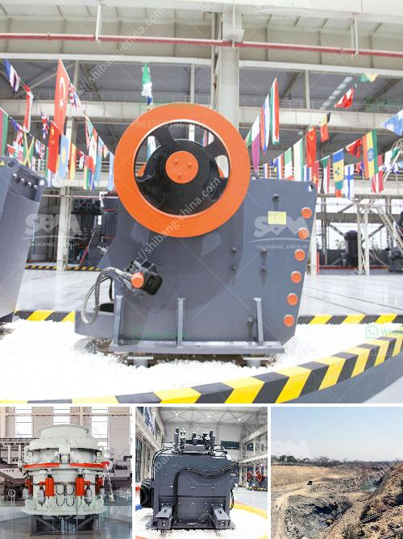

<h3>mobile chrome wash plant for sale</h3>
In the mining industry, chromite ore is widely used to extract chromium. Chromium is a vital metal that is often used in diverse industries such as steel, pharmaceuticals, and electric insulation. Therefore, the demand for chromite ore is constantly high. Mobile chrome wash plant is a newly developed washing equipment that can efficiently recover chromium from chromite ore. It is widely used in many industries such as construction, mining, metallurgy, water conservancy, transportation, chemical engineering, etc.

The mobile chrome wash plant machines up for sale are from leading manufacturers and suppliers in the industry. The chrome washing plant machines up for sale are from the leading sellers and trusted manufacturers. Hence, they guarantee optimum performance and longevity. These chrome wash plant for sale are automatic and multifunctional, making them ideal for various industries such as mining, construction, and agriculture.

The mobile chrome wash plant for sale uses the most advanced ore dressing technology to separate heavy minerals, such as gold, silver, tungsten, tin, tantalum, iron, manganese, chrome, titanium, lead, zinc, etc. It has the features of high recovery rate, large processing capacity, stable operation, and easy maintenance. The mobile chrome wash plant can be customized according to the specific requirements of customers.

One of the key features of the mobile chrome wash plant for sale is its mobility. It can be easily transported to the desired location, which allows flexibility of operation. This is especially critical in mining operations where deposits may be in remote areas. The mobile chrome wash plant can reach the mining site quickly and start processing without the need for extensive infrastructure development.

The mobile chrome wash plant for sale is also designed with sustainability in mind. It incorporates water recycling and tailings management systems, reducing water consumption and environmental impact. Moreover, it utilizes energy-efficient technologies, minimizing the carbon footprint of the operation.

When considering purchasing a mobile chrome wash plant, it is important to choose a reputable manufacturer or supplier. They should have a proven track record of delivering high-quality equipment that meets industry standards. Furthermore, they should provide excellent after-sales service, including technical support and spare parts availability.

In conclusion, the mobile chrome wash plant for sale is an efficient and eco-friendly solution for extracting chromium from chromite ore. It offers flexibility of operation, high recovery rate, and sustainability. With the increasing demand for chromium in various industries, investing in a mobile chrome wash plant can prove to be a wise decision. However, it is crucial to choose a reliable manufacturer or supplier to ensure the quality and performance of the equipment.
<h3>Contact us</h3><ul><li><strong>Whatsapp:&nbsp;<a href="https://wa.me/8613661969651">+8613661969651</a></strong></li><li><a href="https://swt.shibang-china.com/?git&amp;zhl&amp;mobile chrome wash plant for sale"><strong>Online Service(chat now)</strong></a></li></ul><h3>Related</h3><ul><li><a href='mobile rock crusher rental in malaysia.md'>mobile rock crusher rental in malaysia</a></li><li><a href='stone crusher machine price portable.md'>stone crusher machine price portable</a></li><li><a href='single cylinder hydraulic cone crusher.md'>single cylinder hydraulic cone crusher</a></li><li><a href='crushing plants suppliers sales in nigeria.md'>crushing plants suppliers sales in nigeria</a></li><li><a href='quarry aggregate manufacturing process ppt.md'>quarry aggregate manufacturing process ppt</a></li></ul>