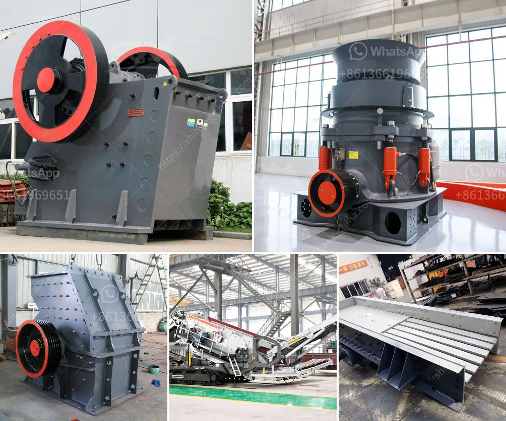

<h3>mobile chrushers south africa</h3>
In recent years, South Africa has witnessed a significant growth in the construction and infrastructure sectors, leading to a rise in the demand for mobile crushers. In turn, this has spurred the development of innovative crushing and screening solutions in the country. Mobile crushers and screeners are becoming pivotal in the production of aggregates and materials, making them indispensable in the construction industry.

Mobile crushers are machines utilized to reduce rocks into smaller, more manageable sizes. These machines are widely used in mining, metallurgy, building materials, highways, railways, water conservancy, and chemical industries. They play a crucial role in transforming large rocks and stones into smaller particles of varying sizes, making them suitable for further processing or usage in construction projects.

South Africa, being a resource-rich region, has a number of mining operations, which require the processing of large quantities of raw materials, such as granite, limestone, and iron ore. Mobile crushers enable efficient crushing and material processing, leading to increased productivity and profitability of these mining operations.

Furthermore, South Africa's rapidly growing population and urbanization have resulted in a surge in the construction industry. This increased construction activity calls for the need to produce aggregates for various applications, including road construction, building foundations, and concrete production. Mobile crushers enable efficient on-site processing of materials, reducing the costs and time required for transportation and processing.

Mobile crushers come in various types and sizes to cater to different applications and requirements. Jaw crushers are commonly used for primary crushing, while impact crushers and cone crushers are utilized for secondary and tertiary crushing. Additionally, screens are often incorporated with mobile crushers to separate the desired material sizes and ensure the quality of the final product.

One of the leading manufacturers of mobile crushers in South Africa is Pilot Crushtec. Pilot Crushtec offers an extensive range of mobile crushers suitable for various applications, including quarrying, mining, recycling, and construction. Their range includes jaw crushers, impact crushers, cone crushers, and screens, which are all designed to meet rigorous South African conditions.

The benefits of mobile crushers in South Africa extend beyond their use on mining and construction sites. Mobile crushers offer a range of recycling opportunities, as they can process a variety of materials, including asphalt, concrete, and brick waste, into reusable aggregates. They can also be used to produce fill materials for landscaping and erosion control projects.

Moreover, mobile crushers are designed to be highly mobile and can be easily transported from one site to another. This flexibility allows for on-site crushing at various locations, reducing the need for material transportation and associated costs. Consequently, mobile crushers offer a sustainable and environmentally friendly solution for resource utilization.

In conclusion, mobile crushers have become an essential tool in South Africa's construction and mining industries. These machines provide an efficient and cost-effective solution for processing raw materials and producing aggregates on-site. With the continued growth of the country's construction and infrastructure sectors, the demand for mobile crushers is expected to remain strong. As a result, manufacturers, such as Pilot Crushtec, continue to innovate and develop new solutions to meet the evolving needs of the South African market.
<h3>Contact us</h3><ul><li><strong>Whatsapp:&nbsp;<a href="https://wa.me/8613661969651">+8613661969651</a></strong></li><li><a href="https://swt.shibang-china.com/?git&amp;zhl&amp;mobile chrushers south africa"><strong>Online Service(chat now)</strong></a></li></ul><h3>Related</h3><ul><li><a href='stone crusher for agriculture.md'>stone crusher for agriculture</a></li><li><a href='stone crushers for sale in south korea.md'>stone crushers for sale in south korea</a></li><li><a href='delhi ball mill ceramic lining.md'>delhi ball mill ceramic lining</a></li><li><a href='sand washing machine for sale.md'>sand washing machine for sale</a></li><li><a href='definivion jaw crusher.md'>definivion jaw crusher</a></li></ul>