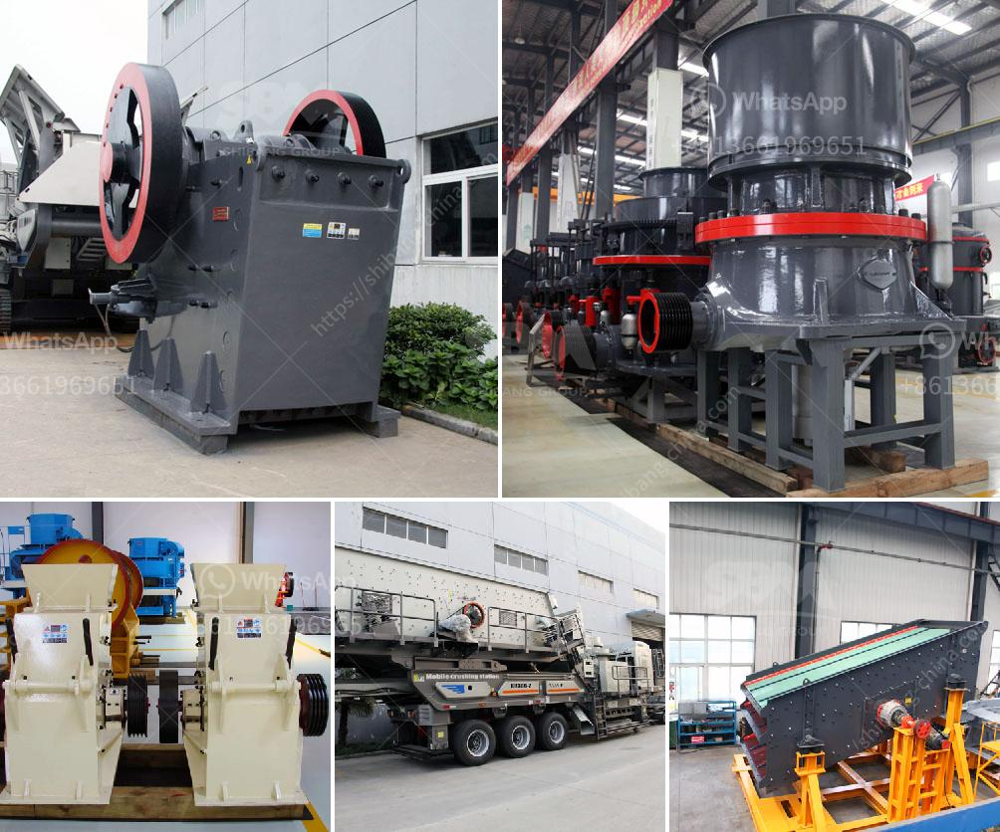

<h3>mobile coal screen units south africa</h3>
The mobile coal screen units in South Africa are designed specifically for the screening of coal material to the highest standards. The plant is compact and offers maximum mobility and flexibility of operation. It is fitted with heavy-duty screens that ensure reliable operation even under the most demanding conditions.

The mobile coal screen units are self-contained, which means they can be set up in a matter of hours and easily transported to different locations. This makes them ideal for use in remote areas or where there is limited infrastructure. Mobile coal screen units are widely used in coal processing to achieve a variety of different product specifications.

The screens are designed to separate different sizes of coal particles, removing unwanted fines and ensuring that the product meets the required specifications. This is particularly important in industries such as power plants, where the quality of coal used directly affects the efficiency of electricity generation.

In addition to their screening capabilities, mobile coal screen units also feature integrated conveyors that allow for easy transportation of the screened coal to further processing or storage facilities. This eliminates the need for additional equipment and streamlines the production process.

The mobile coal screen units in South Africa are built to withstand tough conditions, making them reliable and durable even in harsh environments. They are equipped with advanced technology and high-quality components, ensuring long-lasting performance and efficient operation.

Overall, mobile coal screen units in South Africa play a crucial role in the coal mining industry, enabling the efficient processing of coal and contributing to the country's energy production. Their flexibility, mobility, and reliability make them a valuable asset in the screening process, ensuring the production of high-quality coal for various applications.
<h3>Contact us</h3><ul><li><strong>Whatsapp:&nbsp;<a href="https://wa.me/8613661969651">+8613661969651</a></strong></li><li><a href="https://swt.shibang-china.com/?git&amp;zhl&amp;mobile coal screen units south africa"><strong>Online Service(chat now)</strong></a></li></ul><h3>Related</h3><ul><li><a href='process of a granite crusher machine.md'>process of a granite crusher machine</a></li><li><a href='granite crushing production line.md'>granite crushing production line</a></li><li><a href='gypsum machine in germany.md'>gypsum machine in germany</a></li><li><a href='quarry equipment leasing companies in nigeria.md'>quarry equipment leasing companies in nigeria</a></li><li><a href='granite mining business model.md'>granite mining business model</a></li></ul>