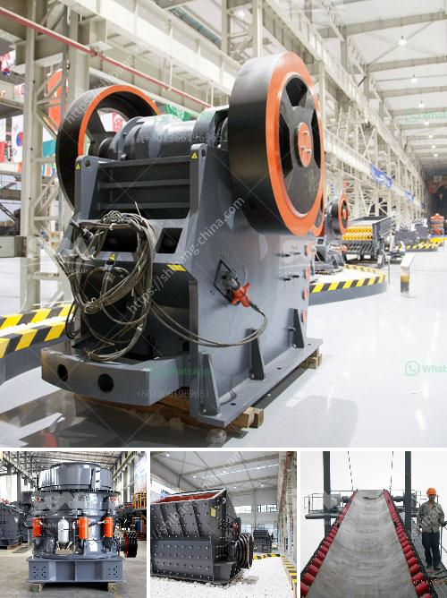

<h3>mobile crusher machine supplier</h3>
With the increasing popularity of mobile crushers in the mining industry, a growing number of manufacturers have entered the market. As a result, it has become increasingly challenging to identify a reliable mobile crusher machine supplier. However, finding the right supplier is crucial for ensuring efficient crushing operations and maximizing productivity.

A reputable mobile crusher machine supplier offers a wide range of crushing equipment that caters to various requirements and budgets. These machines are designed to crush different types of materials, ranging from hard rocks to softer materials like limestone and recycled concrete. They are used extensively in mining, construction, and quarrying applications.

One of the primary advantages of mobile crushers is their flexibility. They can be easily transported to different locations, making them ideal for on-site crushing. This eliminates the need for costly transportation of materials, resulting in significant cost savings. Additionally, mobile crushers can be readily set up and dismantled, making them an excellent choice for temporary projects or remote locations.

Another crucial aspect to consider when choosing a mobile crusher machine supplier is the reliability and durability of their equipment. Mobile crushers are subjected to extreme conditions, including high temperatures, dust, and vibrations. Therefore, it is essential to select machines that are built to withstand such challenging environments. A reliable supplier provides robust and well-designed machines, equipped with advanced features to ensure long-lasting performance.

Furthermore, it is important to consider after-sales support when selecting a mobile crusher machine supplier. Reliable suppliers offer comprehensive customer support, including technical assistance, spare parts availability, and repair services. This ensures minimal downtime in case of any equipment malfunctions, allowing for uninterrupted operations.

In conclusion, finding the right mobile crusher machine supplier is essential for efficient crushing operations. An experienced supplier offers a wide range of crushing equipment, robust and durable machines, and comprehensive after-sales support. By choosing a reliable supplier, industries can enhance their productivity, minimize costs, and achieve successful crushing outcomes.
<h3>Contact us</h3><ul><li><strong>Whatsapp:&nbsp;<a href="https://wa.me/8613661969651">+8613661969651</a></strong></li><li><a href="https://swt.shibang-china.com/?git&amp;zhl&amp;mobile crusher machine supplier"><strong>Online Service(chat now)</strong></a></li></ul><h3>Related</h3><ul><li><a href='crushing equipment for sale in kenya.md'>crushing equipment for sale in kenya</a></li><li><a href='quarrying crusher machines south africa.md'>quarrying crusher machines south africa</a></li><li><a href='machines used for mining gypsum.md'>machines used for mining gypsum</a></li><li><a href='hp ball mill motors.md'>hp ball mill motors</a></li><li><a href='quarry dan peralatan yang dibutuhkan.md'>quarry dan peralatan yang dibutuhkan</a></li></ul>