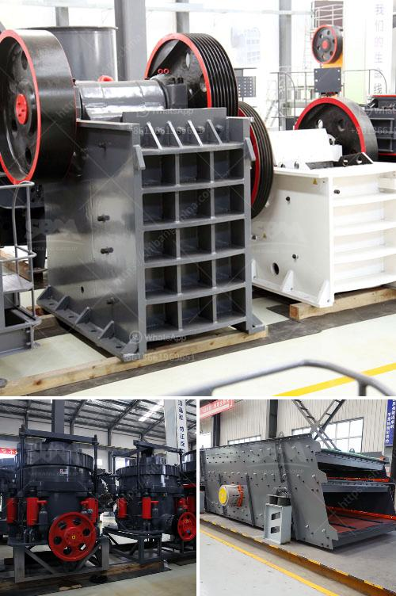

<h3>mobile crusher plant for hire in south africa</h3>
Nowadays, mobility has become a key factor in guaranteeing profitability and efficiency in industries that require heavy-duty materials handling, such as construction, mining, and quarrying. Thus, mobile crusher plant is the best choice for their needs. Mobile crusher plant is a highly portable and versatile machine that offers numerous advantages including cost savings, reduced setup time, and excellent maneuverability.

The mobile crusher plant for hire in South Africa, manufactured by Sandvik, is the ideal choice for a wide range of applications. Not only does it provide high-performance crushing capabilities, but it also ensures that you can carry out your operations efficiently and effortlessly. As a compact and lightweight machine, it can be easily transported to any location, making it suitable for both small-scale projects and large-scale operations.

One of the key advantages of mobile crusher plant is its ability to move, which greatly reduces transportation costs and saves time. With its compact design, the mobile crusher plant can be easily transported on highways and moved to crushing sites, eliminating the need for costly and time-consuming transportation. This ensures that materials can be processed on-site, resulting in faster project completion and reduced downtime.

Another advantage of mobile crusher plant is its excellent maneuverability. Equipped with a crawler track, it can easily access even the most rugged terrains, allowing you to reach remote areas and extract materials efficiently. This makes the mobile crusher plant a perfect choice for mining and quarrying operations, where access to remote sites is often a challenge.

Overall, the mobile crusher plant for hire in South Africa is an ideal choice for those who want to execute their projects efficiently and cost-effectively. Offering a high level of convenience and flexibility, it ensures that you can carry out your operations with minimum hassle. Whether you need to crush materials for construction, mining, or quarrying, the mobile crusher plant is the right machine for the job.
<h3>Contact us</h3><ul><li><strong>Whatsapp:&nbsp;<a href="https://wa.me/8613661969651">+8613661969651</a></strong></li><li><a href="https://swt.shibang-china.com/?git&amp;zhl&amp;mobile crusher plant for hire in south africa"><strong>Online Service(chat now)</strong></a></li></ul><h3>Related</h3><ul><li><a href='kaolin industry machine dhaka bangladesh.md'>kaolin industry machine dhaka bangladesh</a></li><li><a href='bauxite beneficiation plant.md'>bauxite beneficiation plant</a></li><li><a href='bentonite processing plant in maharashtra.md'>bentonite processing plant in maharashtra</a></li><li><a href='stationary crusher plant.md'>stationary crusher plant</a></li><li><a href='jaw crusher shaft parts diagram.md'>jaw crusher shaft parts diagram</a></li></ul>