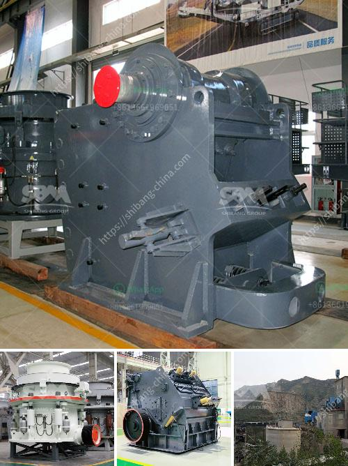

<h3>mobile crusher sale</h3>
In today's rapidly evolving world, we all require innovative solutions to make our lives easier. Mobile crushers have emerged as the go-to solution for efficient crushing needs, especially in the mining and construction industries. Their ability to process various materials on-site drastically reduces transportation costs while ensuring crushing tasks are completed effectively.

One of the primary advantages of mobile crushers is their versatility. Equipped with powerful jaw crushers or impact crushers, they can handle a wide range of materials, from hard rock to recycled materials. This versatility allows for a variety of applications, making mobile crushers an invaluable asset on construction sites and mining operations.

Moreover, mobile crushers offer significant time and cost savings compared to traditional crushing methods. With the ability to operate in remote locations, materials can be processed directly at the source, eliminating the need for transportation to a stationary crusher. This reduces fuel consumption and carbon emissions, making mobile crushers an environmentally friendly choice.

Another advantage of mobile crushers is their compact design, which allows for easy transportation and setup. Most mobile crushers can be transported on a standard truck trailer, making them highly portable and suitable for both short-term and long-term projects. With rapid setup times, crushing operations can commence quickly, enhancing operational efficiency.

Furthermore, mobile crushers offer enhanced safety features. Advanced systems, such as remote monitoring and control, ensure that operators can keep a safe distance and avoid potential hazards. This not only minimizes the risk of accidents but also increases overall productivity.

As the demand for mobile crushers continues to rise, the market offers a wide range of options to choose from. Whether it's a compact, low-capacity model suitable for small construction projects or a heavy-duty crusher capable of handling large quantities of material, there is a mobile crusher for every need.

In conclusion, mobile crushers have revolutionized the way crushing tasks are carried out, offering a cost-effective, versatile, and efficient solution. With the ability to process various materials on-site and reduce transportation costs, they have become an essential tool in the construction and mining industries. Their compact design, enhanced safety features, and easy setup further contribute to their popularity. Embracing mobile crushers is the way forward for businesses looking to streamline their crushing operations while saving time, money, and resources.
<h3>Contact us</h3><ul><li><strong>Whatsapp:&nbsp;<a href="https://wa.me/8613661969651">+8613661969651</a></strong></li><li><a href="https://swt.shibang-china.com/?git&amp;zhl&amp;mobile crusher sale"><strong>Online Service(chat now)</strong></a></li></ul><h3>Related</h3><ul><li><a href='kaolin crusher manufacturers in uk.md'>kaolin crusher manufacturers in uk</a></li><li><a href='vibrating screen manufacturing process.md'>vibrating screen manufacturing process</a></li><li><a href='jaw crusher south africa used.md'>jaw crusher south africa used</a></li><li><a href='zimbabwe mobile crusher rentals.md'>zimbabwe mobile crusher rentals</a></li><li><a href='used stone crusher in usa for sale.md'>used stone crusher in usa for sale</a></li></ul>