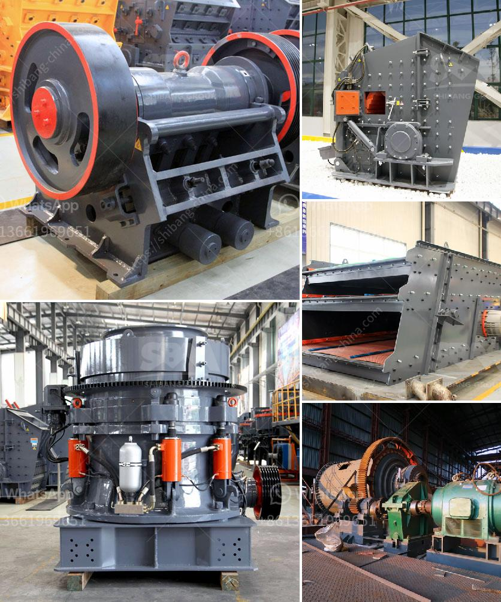

<h3>mobile crushers quarry plant south africa</h3>
Mobile crushers are gaining popularity in the quarrying industry due to their efficiency and ease of operation. With the increasing demand for aggregates from the construction sector, the need for mobile crushers is growing rapidly. South Africa, being a mineral-rich country with a booming construction industry, provides the perfect platform for mobile crushers to thrive.

Mobile crushers, also known as track-mounted crushers or wheel-mounted crushers, are machines that are specifically designed to reduce large rocks into smaller aggregates such as gravel, sand, or rock dust. These machines utilize a heavy-duty design and are equipped with hydraulic-driven systems to make the crushing process more efficient.

A quarry plant in South Africa operates 24/7, which means that maintenance on mobile crushers is often overlooked. Maintenance is an essential part of ensuring the longevity of these machines and preventing unexpected breakdowns. Regular maintenance includes lubricating moving parts, inspecting belts and hoses, and cleaning filters.

Mobile crushers offer numerous advantages to quarry operators in South Africa. For instance, the ability to move from one site to another allows operators to save time and money on transportation costs. Additionally, mobile crushers can be set up closer to the blasting site, which further reduces transportation costs and increases efficiency.

Furthermore, the mobility of these machines allows for better access to hard-to-reach areas within the quarry. This ensures that all available resources are extracted efficiently, maximizing the productivity of the quarry operation.

In terms of productivity, mobile crushers outperform their stationary counterparts in several ways. Firstly, mobile crushers are equipped with a powerful engine that allows them to process a significant amount of material in a short amount of time. This helps increase production and meet the high demand for aggregates.

Secondly, mobile crushers are equipped with advanced crushing technology, such as impact crushing or cone crushing, which ensures high-quality and consistent end products. These machines can crush various types of rocks, including hard granite, limestone, and basalt.

In addition to their productivity, mobile crushers also offer environmental benefits. This is achieved through their efficient use of fuel, which reduces carbon emissions. Some mobile crushers are even equipped with hybrid systems or electric engines, further reducing their environmental impact.

Overall, mobile crushers have revolutionized the quarrying industry in South Africa. They offer significant advantages that traditional stationary crushers cannot match. Their mobility, productivity, and environmental benefits make them an excellent choice for quarry operators seeking to increase efficiency and reduce costs.

As the construction industry in South Africa continues to grow, the demand for aggregates will only increase. Mobile crushers will undoubtedly play a crucial role in meeting this demand and ensuring the success of the quarrying industry. With their efficiency, ease of operation, and environmental benefits, mobile crushers are set to revolutionize the way aggregates are produced in South Africa.
<h3>Contact us</h3><ul><li><strong>Whatsapp:&nbsp;<a href="https://wa.me/8613661969651">+8613661969651</a></strong></li><li><a href="https://swt.shibang-china.com/?git&amp;zhl&amp;mobile crushers quarry plant south africa"><strong>Online Service(chat now)</strong></a></li></ul><h3>Related</h3><ul><li><a href='iron ore processing machine cost.md'>iron ore processing machine cost</a></li><li><a href='manufactures hammer mills.md'>manufactures hammer mills</a></li><li><a href='ball mill grinding media work.md'>ball mill grinding media work</a></li><li><a href='stone crushing units.md'>stone crushing units</a></li><li><a href='crusher material for stone.md'>crusher material for stone</a></li></ul>