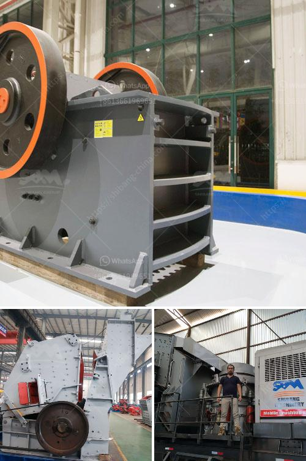

<h3>mobile crushers zenith</h3>
The demand for mobile crushers and screeners is witnessing a steady rise across the world, thanks to the significant growth in the construction industry and the increasing focus on recycling and waste management. Mobile crushers and screeners are adaptable and highly productive machines that are designed to crush different types of materials, including rocks, soil, and ores. Zenith, a renowned mobile crusher manufacturer and supplier, has developed a range of high-performing mobile crushers that boost productivity and efficiency in various construction and recycling projects.

One of the key benefits of mobile crushers and screeners is their ability to process materials directly on-site, which eliminates the need for transportation of materials and reduces operational costs significantly. Zenith's mobile crushers are equipped with high-quality jaw crushers, cone crushers, and impact crushers that provide efficient crushing performance. They are built to withstand even the toughest conditions, ensuring reliable and consistent operation.

Another standout feature of Zenith's mobile crushers is their compact design, which makes them easy to transport and maneuver in tight spaces. Whether working on construction sites or in quarries, these mobile crushers can easily navigate through narrow tunnels, passageways, and rugged terrains, ensuring continuous operation and maximum productivity. Additionally, the compact design allows for quick setup and dismantling, making them ideal for temporary projects or when frequent relocation is required.

Zenith's mobile crushers are also equipped with advanced technology and intelligent control systems that enhance the overall efficiency and safety of the machines. The intelligent control system optimizes the crushing process and monitors the machine's functions, ensuring smooth operation and preventing any potential damage. This advanced technology allows for remote monitoring and troubleshooting, minimizing downtime and maximizing productivity.

One of the notable mobile crushers offered by Zenith is the LT series, which is ideal for medium-sized operations and suited for applications involving hard rock crushing. The LT series features a superior combination of high crushing capacity, versatility, and fuel efficiency. With various models available, customers can choose the one that best suits their specific requirements and budget.

Furthermore, Zenith offers a comprehensive range of mobile screeners that provide efficient separation of materials. These mobile screeners are equipped with high-quality vibrating screens that enable precise screening of different-sized materials, ensuring high-quality end products. The mobile screeners also feature user-friendly controls and customizable settings, allowing operators to adjust the screening process according to the specific needs of the project.

In conclusion, Zenith's mobile crushers and screeners have revolutionized the construction and recycling industries by offering high productivity, efficiency, and versatility. With their compact design, advanced technology, and robust construction, these mobile crushers are built to withstand even the toughest working conditions. Zenith's range of mobile crushers provides an efficient solution for on-site crushing and screening of various materials, reducing transportation costs and increasing overall efficiency. With their intelligent control systems and remote monitoring capabilities, these mobile crushers ensure reliable and safe operation while optimizing productivity. With their commitment to innovation and quality, Zenith continues to be a leading player in the mobile crusher market.
<h3>Contact us</h3><ul><li><strong>Whatsapp:&nbsp;<a href="https://wa.me/8613661969651">+8613661969651</a></strong></li><li><a href="https://swt.shibang-china.com/?git&amp;zhl&amp;mobile crushers zenith"><strong>Online Service(chat now)</strong></a></li></ul><h3>Related</h3><ul><li><a href='copper crusher suppliers in zambia.md'>copper crusher suppliers in zambia</a></li><li><a href='japan granite machine.md'>japan granite machine</a></li><li><a href='small soft stone crusher.md'>small soft stone crusher</a></li><li><a href='calcium carbonate grinding mill price.md'>calcium carbonate grinding mill price</a></li><li><a href='crusher plant cost in pakistan.md'>crusher plant cost in pakistan</a></li></ul>