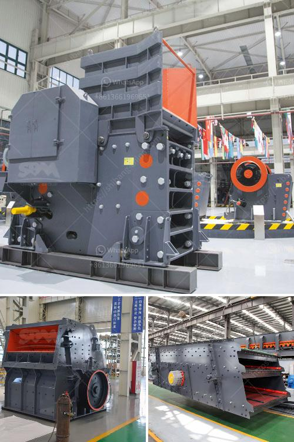

<h3>mobile crushing plant canada</h3>
Mobile crushing plant in Canada is used widely in mining industry, iron ore processing industry, aggregate crushing plant, clay mines, rock quarry, etc. It incorporates three crushing types and it can be operated 720 hours continuously.

1. Highly efficient: The mobile crushing plant is able to generate remarkable levels of production. Even with the toughest materials, this machine is capable of crushing rocks, ore, and construction waste to various sizes. Its equipped with jaw crusher, impact crusher, cone crusher, vibrating screen, and belt conveyor to ensure high productivity.

2. Portable and flexible: Unlike traditional crushers that require several trucks to transport, the mobile crushing plant can be transported easily on a standard trailer. It can be used multiple times, and its compact size makes it ideal for working in confined areas. Whether in quarries or on construction sites, the mobility of the plant allows for easy relocation and set-up, saving time and money.

3. Environmentally friendly: Mobile crushing plants produce less noise and emissions compared to traditional crushing plants. The advanced technology and design of the plant ensure that it operates in a more energy-efficient manner, reducing fuel consumption and the overall carbon footprint. It also reduces the need for truck transportation, resulting in less air pollution.

4. Cost-effective: The initial investment for a mobile crushing plant may be higher than traditional fixed crushers, but it offers long-term cost savings. The ability to move the plant to different locations as needed reduces transportation costs, and the higher efficiency of the plant results in lower operating costs. Moreover, the versatility of the plant allows it to crush various materials, eliminating the need for separate crushing equipment.

In conclusion, mobile crushing plants in Canada provide efficient and cost-effective solutions for rock and ore crushing. With their flexibility, portability, and environmentally friendly features, they are an ideal choice for contractors, quarries, and mining companies. The ability to crush various materials while reducing noise and emissions makes them a sustainable option for the future.
<h3>Contact us</h3><ul><li><strong>Whatsapp:&nbsp;<a href="https://wa.me/8613661969651">+8613661969651</a></strong></li><li><a href="https://swt.shibang-china.com/?git&amp;zhl&amp;mobile crushing plant canada"><strong>Online Service(chat now)</strong></a></li></ul><h3>Related</h3><ul><li><a href='secondary jaw crusher.md'>secondary jaw crusher</a></li><li><a href='500tpd stone crushers.md'>500tpd stone crushers</a></li><li><a href='3 pound ball mill in india.md'>3 pound ball mill in india</a></li><li><a href='crusher manufacturer china.md'>crusher manufacturer china</a></li><li><a href='100tph raw mill specification.md'>100tph raw mill specification</a></li></ul>