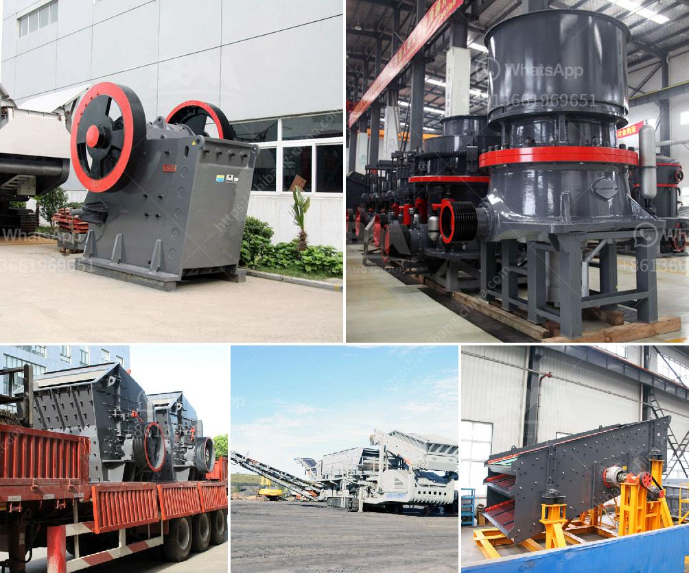

<h3>mobile crushing stone machines from austria</h3>
Mobile crushing stone machines from Austria are extremely popular in the recycling industry. In fact, the global recycling industry has recognized Austria as the pioneer in recycling technology. These machines are multi-functional and have been designed to produce a high-quality gravel aggregate, which is a vital raw material used in construction projects nowadays.

One of the key features of these machines is their flexibility. They can easily be transported from one location to another, making them ideal for on-site crushing. This eliminates the need for transporting the stone to a fixed crusher, which can be costly and time-consuming. The mobile crushing stone machines are also highly efficient, reducing the amount of energy required to crush the stones.

Another advantage of these machines is their ability to process various types of materials. They can crush not only stones but also concrete, asphalt, and other construction waste. This makes them a versatile solution for recycling projects. The crushed materials can then be reused as a base or sub-base for new construction projects.

Additionally, the mobile crushing stone machines from Austria are equipped with advanced technology and features. They have a user-friendly control panel, which allows the operator to easily navigate and control the machine's settings. The machines also have automatic feeding and adjustment systems, ensuring a continuous and efficient operation.

Furthermore, these machines are known for their durability and longevity. They are built to withstand harsh working conditions, making them a reliable investment for any recycling business. They also require minimal maintenance, resulting in reduced downtime and increased productivity.

In conclusion, mobile crushing stone machines from Austria are revolutionizing the recycling industry. Their flexibility, efficiency, versatility, and advanced features make them an ideal choice for on-site stone crushing and recycling projects. With the continuous advancements in technology, these machines are expected to further enhance the recycling process, contributing to a more sustainable future.
<h3>Contact us</h3><ul><li><strong>Whatsapp:&nbsp;<a href="https://wa.me/8613661969651">+8613661969651</a></strong></li><li><a href="https://swt.shibang-china.com/?git&amp;zhl&amp;mobile crushing stone machines from austria"><strong>Online Service(chat now)</strong></a></li></ul><h3>Related</h3><ul><li><a href='200 tph mobile crushing plant.md'>200 tph mobile crushing plant</a></li><li><a href='stone crushing units.md'>stone crushing units</a></li><li><a href='operation of stone crushing plant.md'>operation of stone crushing plant</a></li><li><a href='crusher concrete kuwait.md'>crusher concrete kuwait</a></li><li><a href='stone crusher machine factory in china.md'>stone crusher machine factory in china</a></li></ul>