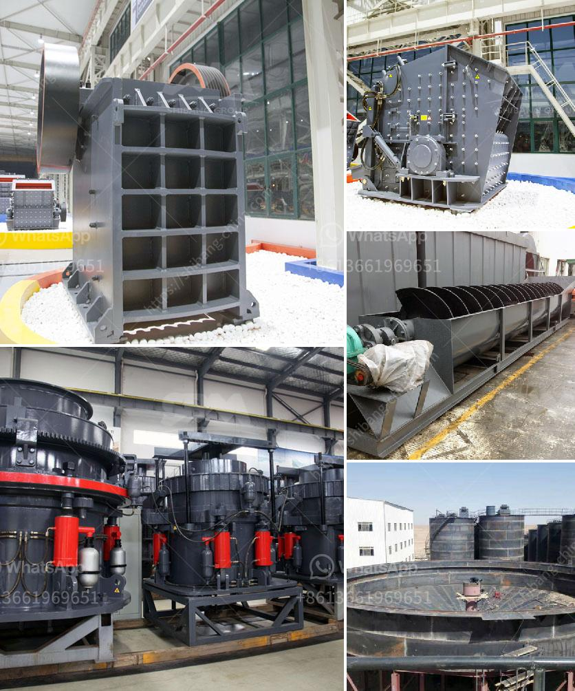

<h3>mobile dms copper concentrate machine</h3>
Copper mining has always been a vital industry, playing a crucial role in various sectors, including electronics, construction, and infrastructure. With the increasing demand for this versatile metal, miners are constantly seeking innovative solutions to enhance production efficiency and reduce costs. One such revolutionary technology that is making waves in the mining industry is the mobile DMS (Dense Media Separation) copper concentrate machine.

Traditionally, mining operations required substantial infrastructure, including fixed plants, to process and extract valuable minerals from the ore. However, the advent of mobile DMS copper concentrate machines has completely transformed the industry and opened up new possibilities. These machines are compact, portable, and can be easily transported to remote mining locations, eliminating the need for costly installations.

The mobile DMS copper concentrate machine utilizes the principle of dense media separation to efficiently separate the copper concentrate from other minerals present in the ore. By suspending the crushed ore in a dense liquid, such as a ferrosilicon solution, the machine creates varying densities within the suspension. The denser copper concentrate sinks to the bottom while the lighter waste material floats on top, allowing for easy separation.

The advantages of using the mobile DMS copper concentrate machine are manifold. Firstly, it enables mining companies to access previously uneconomical deposits in remote or challenging terrains. The portable nature of the machines allows for quick relocation, reducing both transportation costs and time. Moreover, the mobile DMS copper concentrate machine ensures a high degree of flexibility, allowing adjustments to processing volume and enhancing productivity.

Furthermore, this innovative technology promotes environmental sustainability by minimizing the impact on local ecosystems. With no need for permanent installations, disturbances to natural habitats are significantly reduced. Additionally, the machines are designed to be energy-efficient, further decreasing the carbon footprint of mining operations.

In conclusion, the mobile DMS copper concentrate machine represents a groundbreaking development in the mining industry. Its ability to be easily transported, quick setup time, and efficient separation capabilities make it a game-changer for copper mining operations. With its cost-effectiveness and sustainable advantages, this technology is set to redefine the way we extract and process copper concentrates, ultimately benefiting both the industry and the environment.
<h3>Contact us</h3><ul><li><strong>Whatsapp:&nbsp;<a href="https://wa.me/8613661969651">+8613661969651</a></strong></li><li><a href="https://swt.shibang-china.com/?git&amp;zhl&amp;mobile dms copper concentrate machine"><strong>Online Service(chat now)</strong></a></li></ul><h3>Related</h3><ul><li><a href='gypsum factory in ethiopia.md'>gypsum factory in ethiopia</a></li><li><a href='raymond mill for sale.md'>raymond mill for sale</a></li><li><a href='vertical mill ireland.md'>vertical mill ireland</a></li><li><a href='turkey quarry crusher machines manufacturer.md'>turkey quarry crusher machines manufacturer</a></li><li><a href='complete crushing for sale with price.md'>complete crushing for sale with price</a></li></ul>