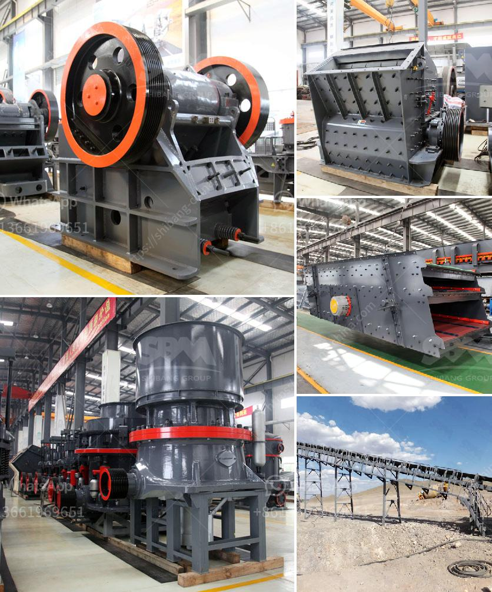

<h3>mobile gold processing plant for sale in south africa</h3>
Mobile gold processing plant contains many types, such as crushing plant, grinding mill, feeding machine, beneficiation machine, and so on. These machines have different functions and are used for different purposes in gold mining. Mobile gold processing plant is one of the most popular equipment used in gold mining.

In recent years, as the market of gold mining industry is developing rapidly, among the many investors, gold ore processing plant for sale is also becoming more and more popular. When you choose the mobile gold processing plant to acquire, the following information, such as device parameters, please consult the manufacturer, or call our customer service hotline for consultation.

The mobile gold processing plant in South Africa is an excellent equipment. It has advanced technology, it can provide flexible configurations according to users' different requirements to meet the actual needs of customers for different configurations, ensure that the mobile gold processing plant can meet various customers' processing operations, and it is easy to operate and maintain, and has high efficiency and energy saving features.

Mobile gold processing plant mainly includes four parts: feeding system, crushing system, screening system and sorting system. Feeding system is used to send raw materials into crushing system. Crushing system is used to crush raw materials into smaller size, so that they can be sent to the next process. Screening system is used to separate the qualified materials from the unqualified ones. Sorting system is used to separate the valuable materials from the waste ones.

The mobile gold processing plant for sale in South Africa has been widely praised in the industry. Our company not only provides customers with a full range of crushing and screening equipment, but also provides customers with experts in the field of design, process installation and commissioning, guiding customers to achieve maximum productivity. In addition, our company also provides customers with perfect after-sales service, timely response to customer inquiries and solve their problems.

In conclusion, the mobile gold processing plant for sale in South Africa is an excellent equipment. It not only can ensure the productivity and high efficiency of gold mining, but also can save a lot of production costs by reducing the cost of transportation and processing. If you are interested in our mobile gold processing plant, please contact us, we will provide you with the most satisfactory service.
<h3>Contact us</h3><ul><li><strong>Whatsapp:&nbsp;<a href="https://wa.me/8613661969651">+8613661969651</a></strong></li><li><a href="https://swt.shibang-china.com/?git&amp;zhl&amp;mobile gold processing plant for sale in south africa"><strong>Online Service(chat now)</strong></a></li></ul><h3>Related</h3><ul><li><a href='limestone crusher rotor mechanical.md'>limestone crusher rotor mechanical</a></li><li><a href='ball mill 5kg capacity price.md'>ball mill 5kg capacity price</a></li><li><a href='mobile gold processing plant for sale.md'>mobile gold processing plant for sale</a></li><li><a href='chrome mining business plan crusher.md'>chrome mining business plan crusher</a></li><li><a href='harga jaw crusher 400x600.md'>harga jaw crusher 400x600</a></li></ul>