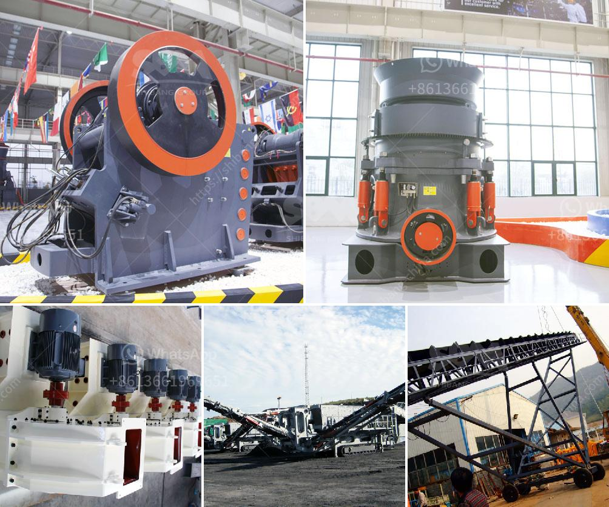

<h3>mobile gold processing plant for sale</h3>
Mobile Gold Processing Plant for Sale: Providing Cost-effective and Efficient Solution for Small-scale Miners

The mining industry is a crucial sector in the global economy, contributing significantly to employment and economic growth. However, small-scale mining operations face numerous challenges, such as limited access to capital, lack of modern equipment, and inefficient processing methods. These factors often result in lower productivity and reduced profitability for small-scale miners.

Recognizing the need for innovative solutions that address these challenges, several companies have developed mobile gold processing plants for sale. These plants are portable and can be easily transported to remote mining locations, enabling small-scale miners to effectively process their ore on-site.

One of the key advantages of mobile gold processing plants is their ability to process ore economically and efficiently. Traditionally, small-scale miners have relied on manual or rudimentary methods such as panning or sluicing to extract gold from ore. While these methods may be effective in some cases, they are labor-intensive and often result in low recovery rates.

Mobile gold processing plants, on the other hand, employ modern processing technologies that can increase gold recovery rates substantially. These plants typically include crushing and grinding circuits, gravity separation systems, and flotation units, among others. Through these processes, gold can be efficiently extracted and separated from other minerals, resulting in higher yields and increased profitability for small-scale miners.

Additionally, mobile gold processing plants provide small-scale miners with access to modern equipment that would otherwise be out of reach due to cost limitations. These plants are designed to be compact and portable, making them suitable for use in remote locations where infrastructure is limited. As a result, small-scale miners can enjoy the benefits of advanced equipment without the need for significant upfront investment.

Furthermore, mobile gold processing plants offer flexibility and scalability, allowing small-scale miners to expand their operations as their production capacity increases. The modular design of these plants enables miners to easily add or remove processing units depending on their needs. This adaptability is particularly valuable for small-scale miners who may not have a stable production rate in the early stages of their operation.

In summary, mobile gold processing plants offer a cost-effective and efficient solution for small-scale miners. These plants enable miners to process their ore on-site, reducing transportation costs and minimizing the need for complex infrastructure. By employing modern processing technologies, these plants can increase gold recovery rates and improve overall profitability for small-scale miners. With their portability, flexibility, and scalability, mobile gold processing plants provide a much-needed boost to the small-scale mining sector.
<h3>Contact us</h3><ul><li><strong>Whatsapp:&nbsp;<a href="https://wa.me/8613661969651">+8613661969651</a></strong></li><li><a href="https://swt.shibang-china.com/?git&amp;zhl&amp;mobile gold processing plant for sale"><strong>Online Service(chat now)</strong></a></li></ul><h3>Related</h3><ul><li><a href='gold mining equipment mobile plant.md'>gold mining equipment mobile plant</a></li><li><a href='iron ore machine process.md'>iron ore machine process</a></li><li><a href='limestone production mining equipment for sale.md'>limestone production mining equipment for sale</a></li><li><a href='mobile stone crusher for sale.md'>mobile stone crusher for sale</a></li><li><a href='brick crusher for sale.md'>brick crusher for sale</a></li></ul>