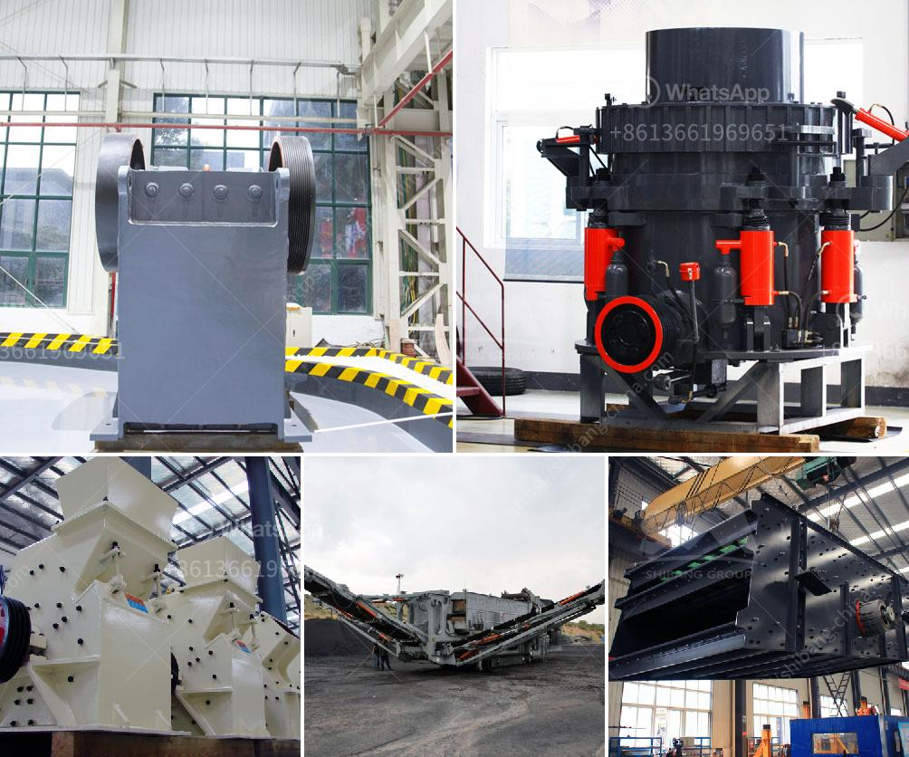

<h3>mobile granite crusher</h3>
Mobile granite crusher is a popular choice for granite processing due to its convenient operation and high efficiency. It is designed to crush granite stones and rocks with different hardness levels. With high wear-resistant capabilities, low maintenance requirements, and low fuel consumption, it is ideal for small-scale mining operations, remote sites, and road construction projects.

One of the key features of mobile granite crushers is mobility. They can be easily moved to different locations, reducing transportation costs and allowing for flexible deployment. This is particularly advantageous in areas with limited accessibility, such as hilly or remote terrains. The mobile design also makes it easy to transport the crusher to different worksites according to project needs.

Another advantage of mobile granite crushers is that they can be set up quickly. Once delivered to the site, the crusher can be operational within minutes. This makes it an efficient solution for time-sensitive projects and reduces downtime. Additionally, because the crusher is mobile, it can be easily adjusted to produce different sizes of crushed granite, making it versatile for various construction applications.

Mobile granite crushers are equipped with all the necessary safety equipment to ensure worker safety. Additionally, they are designed with advanced electronics and monitoring systems that allow for remote control of the crusher operations. This improves safety by eliminating the need for personnel to be near the crusher during operation, reducing the risk of accidents.

One of the key components of mobile granite crushers is the jaw crusher. This primary crushing unit breaks the granite into smaller sizes, which can then be processed into different products. These crushers use compression force to crush the granite, minimizing the amount of abrasive material required to produce the desired fine material. This reduces overall operational costs while maintaining high levels of productivity.

Mobile granite crushers are powered by either diesel or electric engines, with diesel-powered crushers being more common due to their versatility and reliability in remote locations. They are also more fuel-efficient, making them an environmentally friendly choice. Electric crushers can be advantageous in areas with easy access to electricity, reducing fuel consumption and emissions.

In conclusion, mobile granite crushers offer a flexible and efficient solution for granite processing. With their mobility, quick setup time, and high operational safety, they are suitable for a range of projects, including mining operations, road construction, and remote sites. Their ability to crush granite into different sizes makes them versatile for various construction applications. Whether powered by diesel or electric engines, mobile granite crushers are an eco-friendly choice that ensures cost-effective operations and reduces environmental impact.
<h3>Contact us</h3><ul><li><strong>Whatsapp:&nbsp;<a href="https://wa.me/8613661969651">+8613661969651</a></strong></li><li><a href="https://swt.shibang-china.com/?git&amp;zhl&amp;mobile granite crusher"><strong>Online Service(chat now)</strong></a></li></ul><h3>Related</h3><ul><li><a href='industrial application of ball mills.md'>industrial application of ball mills</a></li><li><a href='stone crusher unit project report.md'>stone crusher unit project report</a></li><li><a href='lay out calcium carbonate plant.md'>lay out calcium carbonate plant</a></li><li><a href='stone crusher machine in south africa.md'>stone crusher machine in south africa</a></li><li><a href='copper ore processing machines in usa.md'>copper ore processing machines in usa</a></li></ul>