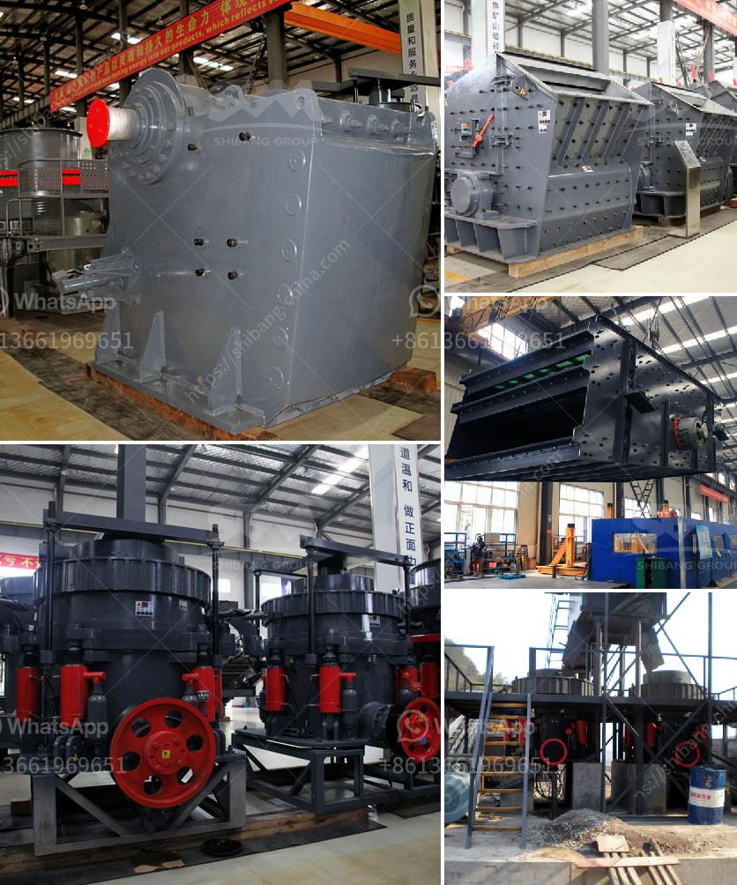

<h3>mobile impact crusher for sale</h3>
Mobile impact crushers are versatile crushing machines that are used to reduce the size of rocks and other materials in various applications. They offer incredible flexibility when it comes to crushing and screening processes, as they are easily transported from one job site to another. This makes them an ideal choice for construction companies and contractors who need to move their crushing equipment frequently.

One of the key advantages of mobile impact crushers is that they can crush a wide range of materials, from soft to medium-hard rocks. This makes them suitable for various industries such as mining, construction, and recycling. With a mobile impact crusher, users can efficiently process materials on-site without the need for cumbersome and expensive transportation. 

Another benefit of mobile impact crushers is their compact size, which allows them to navigate through narrow and tight spaces. This makes them perfect for urban areas where large equipment may face difficulties in reaching certain locations. Furthermore, mobile impact crushers are equipped with advanced features like remote control, allowing operators to easily adjust settings and customize the crushing process according to their specific needs.

When it comes to purchasing a mobile impact crusher, there are several factors to consider. Firstly, the size and capacity of the crusher should meet the requirements of the project. Secondly, it is important to check the quality and durability of the machine, as it will directly impact productivity and maintenance costs. Additionally, it is recommended to choose a reputable and trustworthy manufacturer who offers reliable after-sales support.

In conclusion, mobile impact crushers offer numerous benefits for industries that require efficient and versatile crushing equipment. Their ability to process various materials, compact size, and easy transportation make them a valuable asset for any construction project. With the right choice of a mobile impact crusher, companies can enhance their productivity and reduce operational costs.
<h3>Contact us</h3><ul><li><strong>Whatsapp:&nbsp;<a href="https://wa.me/8613661969651">+8613661969651</a></strong></li><li><a href="https://swt.shibang-china.com/?git&amp;zhl&amp;mobile impact crusher for sale"><strong>Online Service(chat now)</strong></a></li></ul><h3>Related</h3><ul><li><a href='silica sand machinery manufacturer from india.md'>silica sand machinery manufacturer from india</a></li><li><a href='limestone grinding mill china.md'>limestone grinding mill china</a></li><li><a href='jaw crusher price suppliers.md'>jaw crusher price suppliers</a></li><li><a href='copper crusher suppliers in zambia.md'>copper crusher suppliers in zambia</a></li><li><a href='stone crusher price in dubai.md'>stone crusher price in dubai</a></li></ul>