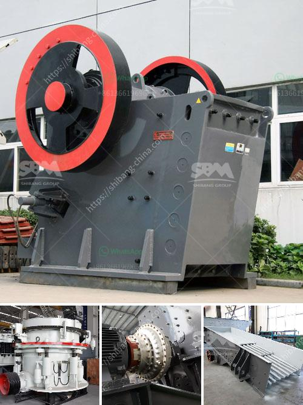

<h3>mobile plant sand screen for sale</h3>
If you are in the market for a mobile plant sand screen, then you are in luck! There are plenty of options available for sale that can meet your specific requirements. A mobile plant sand screen is an essential tool for any construction or mining site as it helps separate unwanted particles from the desired sand material.

One of the key advantages of a mobile plant sand screen is its portability. These screens are designed to be easily moved from one location to another, allowing you to screen materials on-site without the need to transport them elsewhere. This can save you both time and money, as it eliminates the need for additional equipment and transportation costs.

Mobile plant sand screens come in various sizes and capacities, allowing you to choose the one that suits your needs. From small screens ideal for landscaping projects to large screens suitable for mining operations, you can find a wide range of options to choose from.

Additionally, these screens are designed with durability in mind. They are built to withstand harsh conditions and heavy-duty use, ensuring that they can handle the demands of any job site. Many models are also equipped with features like adjustable screening angles, which allow you to control the size and quality of the screened material.

When purchasing a mobile plant sand screen, it is important to consider factors such as the capacity, power source, and maintenance requirements. Ensure that the screen you choose is capable of handling the volume of material you need to process and has a reliable power source. Regular maintenance and servicing of the screen will also extend its lifespan and optimize its performance.

In conclusion, if you are in need of a mobile plant sand screen, there are numerous options available for sale. These screens offer the benefits of portability, versatility, and durability, making them an essential tool for any construction or mining project. Take the time to research and choose the right mobile plant sand screen for your specific needs, and you will be well-equipped to efficiently separate unwanted particles and achieve the desired quality of sand material.
<h3>Contact us</h3><ul><li><strong>Whatsapp:&nbsp;<a href="https://wa.me/8613661969651">+8613661969651</a></strong></li><li><a href="https://swt.shibang-china.com/?git&amp;zhl&amp;mobile plant sand screen for sale"><strong>Online Service(chat now)</strong></a></li></ul><h3>Related</h3><ul><li><a href='mobile rock crusher manufacturers.md'>mobile rock crusher manufacturers</a></li><li><a href='iron ore crushed second hand machines.md'>iron ore crushed second hand machines</a></li><li><a href='impact crusher turkey.md'>impact crusher turkey</a></li><li><a href='vertical shaft impact crusher technical specifications.md'>vertical shaft impact crusher technical specifications</a></li><li><a href='quartz powder ball mill in tamilnadu.md'>quartz powder ball mill in tamilnadu</a></li></ul>