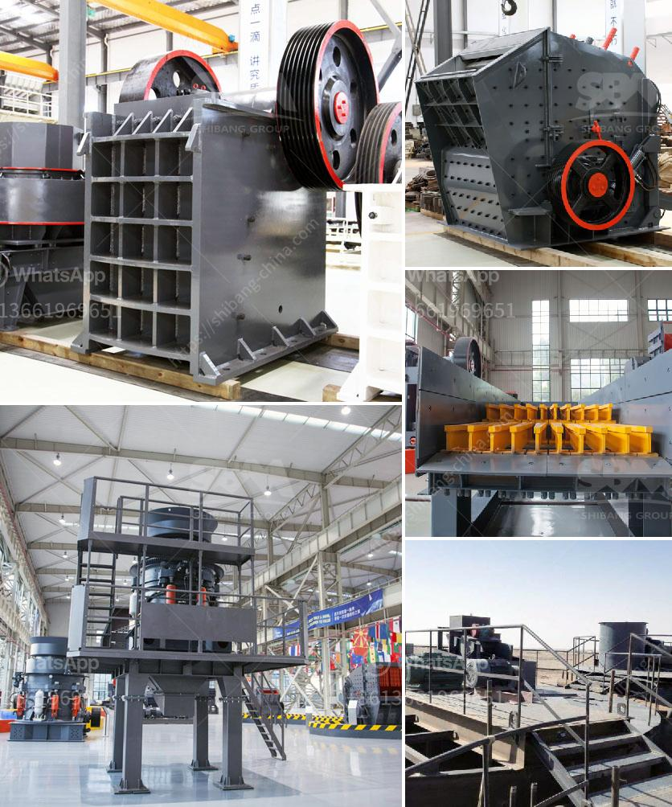

<h3>mobile rock crusher manufacturers</h3>
Rock crushing is a demanding process that requires immense power and efficiency. Mobile rock crusher manufacturers have been fulfiling these demands by providing highly efficient and reliable solutions for crushing rocks of various hardness and challenges. In this article, we will explore the world of mobile rock crusher manufacturers, their innovative technologies, and the benefits they offer to the construction and mining industries.

Mobile rock crusher manufacturers have witnessed substantial growth in recent years due to the increasing demand for aggregate materials used in construction projects. These manufacturers focus on developing state-of-the-art mobile crushers equipped with advanced technologies to ensure maximum productivity and low operating costs. Some of the prominent mobile rock crusher manufacturers operating in the market include Metso, Sandvik, Terex, and Kleemann, among others.

One of the key technologies employed by these manufacturers is the remote-controlled operation of mobile rock crushers. This allows operators to control the crushing process from a safe and comfortable distance, improving both safety and productivity. Additionally, remote-controlled operation enables quick and easily adjustable settings, optimizing the crushing process for different types of materials and applications.

Another crucial development in mobile rock crushers is the integration of GPS technology. GPS tracking systems provide real-time location data, allowing operators to monitor the movement and performance of the crusher. This ensures optimal utilization of the equipment and prevents potential downtime or damage due to unplanned usage in unsuitable terrain or applications.

Furthermore, mobile rock crusher manufacturers are constantly investing in research and development to improve the efficiency of their crushers. They focus on developing crushers that consume less fuel, reduce emissions, and require minimal maintenance. These advancements not only benefit the environment but also contribute to lowering operational costs for the end-users.

Manufacturers are also incorporating innovative features to enhance the versatility of mobile rock crushers. For instance, some models come with detachable screens and conveyor belts, allowing users to produce multiple grades of aggregates on-site. This eliminates the need for additional equipment and transportation, resulting in substantial cost savings.

Mobile rock crushers are designed to be easily transportable, allowing operators to move them quickly between job sites. The use of crawler tracks or wheels ensures smooth maneuverability in diverse terrains and improves accessibility during maintenance and repairs. This mobility is particularly beneficial for construction and mining projects spread across different locations.

Lastly, mobile rock crusher manufacturers offer comprehensive after-sales support to their customers. This includes assistance in installation, training, spare parts availability, and prompt service for routine maintenance or repairs. This commitment to customer satisfaction ensures that the crushers continue to perform optimally throughout their lifespan.

In conclusion, mobile rock crusher manufacturers play a crucial role in providing efficient and reliable crushing solutions for the construction and mining industries. Their focus on technological advancements, mobility, and versatility has transformed the way rocks are processed, leading to increased productivity and cost savings. With ongoing research and innovation, these manufacturers are set to continue revolutionizing the rock crushing industry.
<h3>Contact us</h3><ul><li><strong>Whatsapp:&nbsp;<a href="https://wa.me/8613661969651">+8613661969651</a></strong></li><li><a href="https://swt.shibang-china.com/?git&amp;zhl&amp;mobile rock crusher manufacturers"><strong>Online Service(chat now)</strong></a></li></ul><h3>Related</h3><ul><li><a href='limestone crusher rotor mechanical.md'>limestone crusher rotor mechanical</a></li><li><a href='clay grinder machine india.md'>clay grinder machine india</a></li><li><a href='silica sand production plant in germany.md'>silica sand production plant in germany</a></li><li><a href='slag crusher for sale.md'>slag crusher for sale</a></li><li><a href='used crushing plants for sale in uae.md'>used crushing plants for sale in uae</a></li></ul>