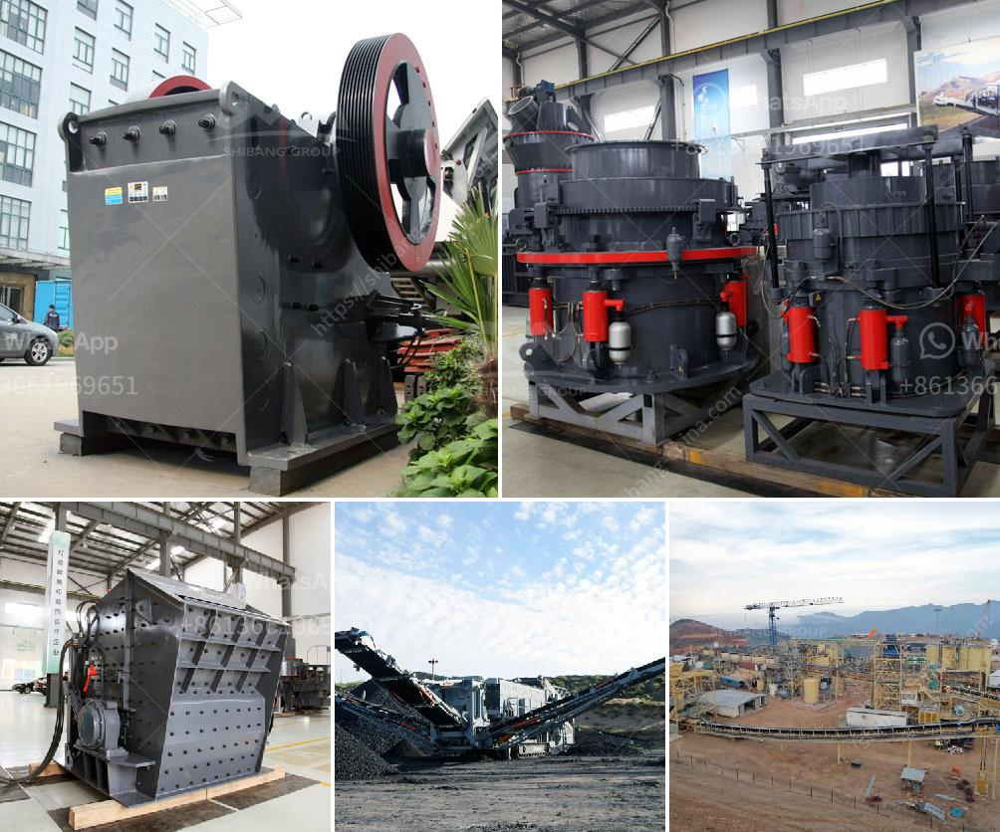

<h3>mobile rock crusher rental in malaysia</h3>
A rock crusher is a machine designed to break large rocks into smaller rocks, gravel, or sand. Rock crushers are commonly used in construction projects and road building. Mobile rock crushing plants can be rented from any mobile crushing company in Malaysia.

Malaysia is a relatively open state-oriented and newly industrialized market economy. The state plays a significant but declining role in guiding economic activity through macroeconomic plans. Malaysia has had one of the best economic records in Asia, with GDP growing an average of 6.5 percent annually from 1957 to 2005. Malaysia’s economy in 2019 was one of the most competitive in the world, ranking 22nd in the Economic Complexity Index.

With a rapidly growing economy, Malaysia has seen an increase in infrastructure projects in recent years. A key component of these projects is the use of rock crushers in the excavation, demolition, and construction processes. These machines help break down large rocks into smaller, more manageable sizes.

Some of the municipalities in Malaysia that have rented mobile rock crushers include Kuala Lumpur, Penang, and Kuching. Rental services for mobile rock crushers are also available in other countries like the United States, Canada, and the United Kingdom. However, there are only a few companies in Malaysia that provide mobile rock crusher rental services.

In Malaysia, mobile rock crusher rental services have been developed for ease of access and use of these machines. Ranging from mini stone crushers to tonne-scale mobile rock crushers, the machines are flexible and capable of crushing rocks of various sizes.

Mobile rock crusher rental services in Malaysia include jaw crushers, cone crushers, and impact crushers. These machines have different crushing capabilities and are used in various applications. Some of the key applications include roadbase, sub-base, aggregates for construction, ore, and mining industries, asphalt, concrete, and other hard rocks and materials.

Renting a mobile rock crusher comes with several benefits. Firstly, it eliminates the need to invest in a costly new machine if you only require it for a short period. Secondly, it allows flexibility in terms of moving the machine to different locations as required by the project. Thirdly, rental services often include maintenance and technical support, reducing downtime and ensuring the efficient operation of the machine.

Mobile rock crusher rental services are a cost-effective option for Malaysia's construction and infrastructure projects. Renting a rock crusher ensures that the project progresses smoothly and efficiently, contributing to the overall success of the project. Whether it is a small-scale or large-scale project, mobile rock crushers are ideal for breaking down rocks into smaller sizes and facilitating various construction activities.
<h3>Contact us</h3><ul><li><strong>Whatsapp:&nbsp;<a href="https://wa.me/8613661969651">+8613661969651</a></strong></li><li><a href="https://swt.shibang-china.com/?git&amp;zhl&amp;mobile rock crusher rental in malaysia"><strong>Online Service(chat now)</strong></a></li></ul><h3>Related</h3><ul><li><a href='stone crushing plant for sale in south africa.md'>stone crushing plant for sale in south africa</a></li><li><a href='price quarry stone crusher.md'>price quarry stone crusher</a></li><li><a href='gold stamp mill for sale in china.md'>gold stamp mill for sale in china</a></li><li><a href='vertical mill ireland.md'>vertical mill ireland</a></li><li><a href='dealers of grinding mills in uganda.md'>dealers of grinding mills in uganda</a></li></ul>