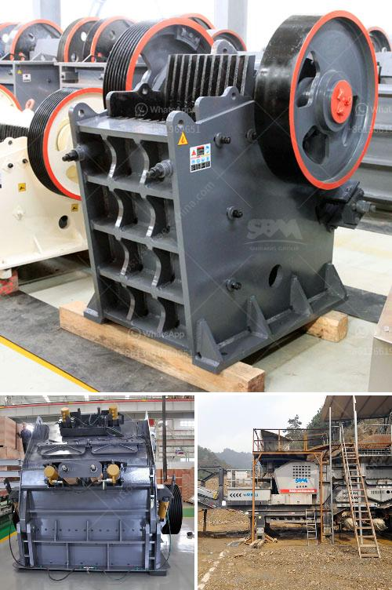

<h3>mobile rock crusher</h3>
In today's fast-paced and demanding construction and mining industries, companies need reliable equipment that can keep up with the demands of the job. One such essential tool is the mobile rock crusher. With this piece of machinery, contractors can effectively break down large rocks and stones into smaller and more manageable sizes. In this article, we will explore the various benefits and applications of the mobile rock crusher.

First and foremost, the mobility factor of a mobile rock crusher plays a crucial role in streamlining construction and mining operations. By eliminating the need for transportation, workers can easily move the crusher from one site to another, reducing downtime and costs associated with disassembling and reassembling fixed crushers. This flexibility allows contractors to quickly set up the crusher at the job site and start crushing rocks on the spot.

Another advantage of the mobile rock crusher is its versatility in terms of application. It can be used to crush rocks of varying hardness levels, from soft limestone to hard granite. This enables contractors to produce a wide range of materials, including road base, drainage aggregates, and concrete and asphalt aggregates. Additionally, the crusher can be equipped with various attachments like a magnetic separator or a vibrating screen, making it even more versatile for different job requirements.

The mobile rock crusher is equipped with a diesel engine or an electric motor. Compared to traditional crushers, this machine conserves energy and reduces emissions. The fuel efficiency of the mobile rock crusher ensures a low cost per tonne of crushed materials, making it the perfect choice for contractors who are looking to save money without compromising output or quality.

Furthermore, the mobile rock crusher is designed for ease of operation. It features user-friendly controls, allowing operators to easily adjust settings and monitor crucial parameters. Additionally, the crusher is equipped with safety features like a hydraulic overload protection system, ensuring that the machine doesn't get damaged in case of an unexpected overload.

In conclusion, the mobile rock crusher has revolutionized the construction and mining industries. Its mobility, versatility, fuel efficiency, and ease of operation make it an indispensable tool for any contractor. Whether it's crushing rocks for road construction or producing aggregates for concrete, the mobile rock crusher delivers high performance and efficiency. With its ability to handle various materials and applications, it is a must-have for any job site. So, if you're in the construction or mining industry, don't overlook the advantages of a mobile rock crusher. Invest in this essential machinery and take your operations to new heights.
<h3>Contact us</h3><ul><li><strong>Whatsapp:&nbsp;<a href="https://wa.me/8613661969651">+8613661969651</a></strong></li><li><a href="https://swt.shibang-china.com/?git&amp;zhl&amp;mobile rock crusher"><strong>Online Service(chat now)</strong></a></li></ul><h3>Related</h3><ul><li><a href='ethiopia stone crushing industry.md'>ethiopia stone crushing industry</a></li><li><a href='how to separate gold from sand with machine.md'>how to separate gold from sand with machine</a></li><li><a href='fuel plant stone crusher.md'>fuel plant stone crusher</a></li><li><a href='small stones to building sand crusher.md'>small stones to building sand crusher</a></li><li><a href='price of stone crusher machine.md'>price of stone crusher machine</a></li></ul>