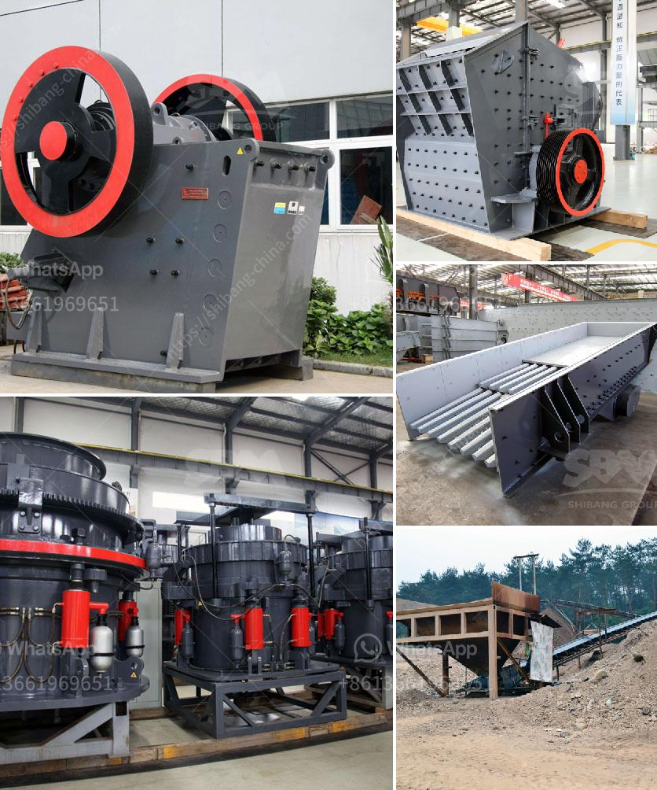

<h3>mobile screen machine</h3>
In today's fast-paced world, our mobile devices have become an integral part of our lives. From business communications to entertainment, we rely on our smartphones and tablets for a multitude of tasks. However, with this increased usage comes the inevitable wear and tear on our screens. This is where the mobile screen machine comes into play.

A mobile screen machine is an innovative tool that allows users to repair their mobile device's screens in a quick and efficient manner. Whether it's a cracked screen or unresponsive touch functions, this machine can solve the problem within minutes, eliminating the need for costly repairs or replacements.

One of the key advantages of a mobile screen machine is its portability. Small and compact, it can easily be carried around and used on the go. This is especially beneficial for individuals who rely heavily on their mobile devices for work or travel frequently. Instead of wasting time searching for repair shops or waiting for days to get the screen fixed, they can simply use the mobile screen machine wherever and whenever required.

Another advantage is its ease of use. Designed with user convenience in mind, these machines are equipped with user-friendly interfaces and step-by-step instructions. Even those with limited technical knowledge can effortlessly repair their screens, saving both time and money. Moreover, the machine usually comes with a variety of screen sizes and models, making it suitable for most popular mobile devices in the market.

Furthermore, the mobile screen machine is an environmentally friendly option. By allowing users to repair their screens instead of replacing them, it reduces electronic waste and promotes sustainability. This is a significant step towards a greener future, as the world is increasingly facing the challenge of excessive electronic waste disposal.

In conclusion, a mobile screen machine is a game-changer for modern living. Its portability, ease of use, and environmental benefits make it a must-have tool for anyone reliant on their mobile devices. Say goodbye to the hassle of searching for repair shops and waiting for screen replacements. With a mobile screen machine, you can get your device back to its original state within minutes, ensuring uninterrupted productivity and entertainment.
<h3>Contact us</h3><ul><li><strong>Whatsapp:&nbsp;<a href="https://wa.me/8613661969651">+8613661969651</a></strong></li><li><a href="https://swt.shibang-china.com/?git&amp;zhl&amp;mobile screen machine"><strong>Online Service(chat now)</strong></a></li></ul><h3>Related</h3><ul><li><a href='primary crushers.md'>primary crushers</a></li><li><a href='want to lease diamond mining equipment in south africa.md'>want to lease diamond mining equipment in south africa</a></li><li><a href='chrome mining business plan.md'>chrome mining business plan</a></li><li><a href='raymond mill for.md'>raymond mill for</a></li><li><a href='cost of a medium size stone crusher.md'>cost of a medium size stone crusher</a></li></ul>