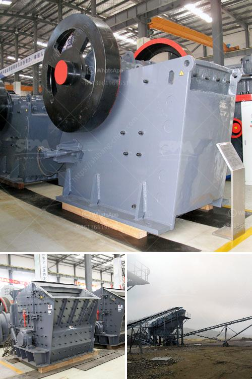

<h3>mobile screening and crushing equipment</h3>
Mobile screening and crushing equipment have revolutionized the way construction and mining companies conduct their operations. These advanced machines have enabled companies to extract materials more efficiently, saving time and resources in the process. With a range of features and capabilities, mobile screening and crushing equipment offer numerous advantages to industry professionals.

One of the primary benefits of mobile screening and crushing equipment is its portability. Unlike traditional equipment that requires fixed locations, these machines can be easily transported to different sites. This allows construction and mining companies to work on multiple projects simultaneously, maximizing their productivity and profitability. Additionally, the ability to move machinery from one site to another eliminates the need for costly transportation charges and reduces downtime between projects.

Another advantage of mobile screening and crushing equipment is its versatility. These machines come equipped with various screening and crushing attachments, allowing companies to process different materials with ease. Whether it is gravel, concrete, or rock, these machines can efficiently extract the desired materials and screen them to the required sizes. This flexibility enables companies to handle a wide range of projects, from road construction to mining operations, without the need for additional equipment.

Furthermore, mobile screening and crushing equipment are equipped with state-of-the-art technology that enhances their performance and efficiency. These machines feature advanced control systems that improve accuracy and precision in processing materials. Additionally, they are designed to minimize downtime through their robust construction and smart maintenance features. These technological advancements ensure that companies can operate their equipment smoothly and maximize their operational uptime.

In conclusion, mobile screening and crushing equipment have transformed the construction and mining industries. Their portability, versatility, and advanced technology make them indispensable tools for industry professionals. Whether it is extracting materials or processing them, these machines offer numerous advantages that increase productivity and profitability. As technology continues to advance, we can expect further innovations in mobile screening and crushing equipment, making these machines even more efficient and effective in the years to come.
<h3>Contact us</h3><ul><li><strong>Whatsapp:&nbsp;<a href="https://wa.me/8613661969651">+8613661969651</a></strong></li><li><a href="https://swt.shibang-china.com/?git&amp;zhl&amp;mobile screening and crushing equipment"><strong>Online Service(chat now)</strong></a></li></ul><h3>Related</h3><ul><li><a href='feasibility studies on lead ore processing.md'>feasibility studies on lead ore processing</a></li><li><a href='used stone crushers dealer.md'>used stone crushers dealer</a></li><li><a href='mini cement plant project report india.md'>mini cement plant project report india</a></li><li><a href='indonesia jaw crusher.md'>indonesia jaw crusher</a></li><li><a href='200 tph mobile crushing plant.md'>200 tph mobile crushing plant</a></li></ul>