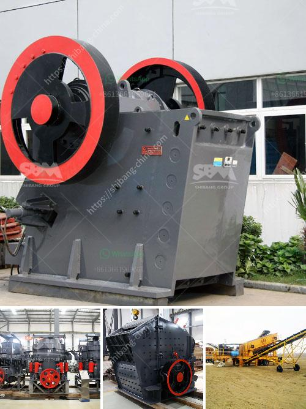

<h3>mobile stone crusher for sale</h3>
Mobile stone crusher, a new designed mobile rock crusher, which is flexible, convenient and strong in mobility, so it can save a large construction capital and relocation. Raw Materials can be broken at the locale without being transported again, and also can be moved with the promotional exploitation of the raw material, which saves a large number of transportation costs.

The mobile stone crusher is composed of primary crushing, screening station, secondary one and belt conveyor. Every crushing station is an independent working unit which can respectively assume their different responsibility, and the belt conveyer is responsible for material transmitting and piling up between each crushing station.

Mobile stone crusher for sale can work independently or together with other devices according to coarse crushing or fine crushing requirements. Likewise, portable plant can be easily adjusted to suit the crushing application by choosing feeding to crusher or feeding to screen options. Reliable performance and convenient maintenance Portable crushing plants adapt excellent quality crusher, screen and feeder made from Shanghai Joyal Mining, yet the quality is stable and reliable. Normal belt conveyor can be used for conveyance of material, which is of mature technology, simply operation, easy maintenance, and low investment.

Mobile stone crusher for sale has many advantages, such as reasonable matching, unobstructed discharge, reliable performance, convenient operation, high efficiency and energy conservation. It can be said that mobile crushing plant is a kind of high-efficient crushing equipment with the advantages of strong flexibility and mobility.

The mobile stone crusher is typically portable type, which means it is barite crusher plant available with chassis and the other components. It can be moved from one location to another easily. According to different crushing requirements, mobile crushing plant can follow screening-after-crushing process or crushing-after-screening process. The mobile stone crusher plant is highefficiency, cost-effective, steady and sound mobility, which can save a large amount of infrastructure construction and relocation expenses. The mobile crushing station is widely used in mining, coal, refuse and recycling of construction waste, earthwork, urban infrastructure, roads or construction sites and other venues. It also can be used in topsoil and a variety of other materials processing; separation viscous coagulation aggregate; construction and demolition industry; broken after the screening; quarrying industry.

The mobile stone crusher plant is one of the key crushing equipments in the market, especially for construction waste and city garbage disposal. It has the advantages of high efficiency, low energy consumption, high performance and environmental protection. The mobile stone crusher plant is a valuable machine for virtually any business.

This plant allows you to crush and recycle stones, concrete, asphalt, bricks, and more. The plant turns the debris into gravel which can be used in other construction projects. The machine is easy to operate and you can quickly crush even the hardest stones with it. Mobile Crusher is a highly customizable combination of feeder, rock crusher, vibrating screen, conveyor, etc. Applications: aggregate, quarrying, mining, construction waste recycling, etc.
<h3>Contact us</h3><ul><li><strong>Whatsapp:&nbsp;<a href="https://wa.me/8613661969651">+8613661969651</a></strong></li><li><a href="https://swt.shibang-china.com/?git&amp;zhl&amp;mobile stone crusher for sale"><strong>Online Service(chat now)</strong></a></li></ul><h3>Related</h3><ul><li><a href='what is a mobile crusher.md'>what is a mobile crusher</a></li><li><a href='used stone crusher for sale in florida.md'>used stone crusher for sale in florida</a></li><li><a href='mobile aggregate plant for sale in the philippines.md'>mobile aggregate plant for sale in the philippines</a></li><li><a href='feldspar crusher manufacturer.md'>feldspar crusher manufacturer</a></li><li><a href='aggregates crusher plant near in manila.md'>aggregates crusher plant near in manila</a></li></ul>