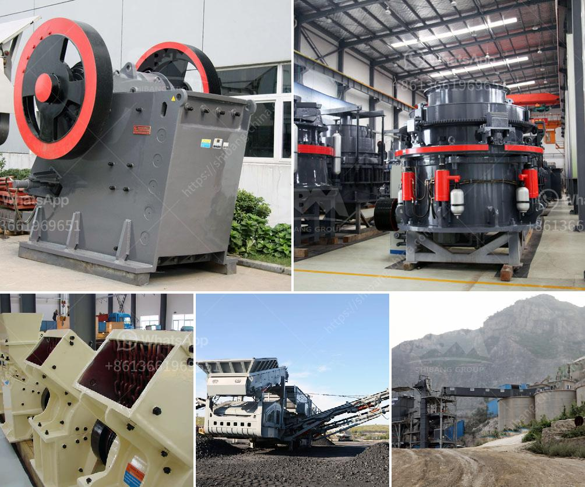

<h3>mobile vsi crusher</h3>
In today's fast-paced environment, everyone is striving to maximize productivity and efficiency. This holds especially true for industries such as construction, mining, and quarrying, where the need to crush large rocks and stones into smaller pieces is a daily necessity. Luckily, the advent of mobile crushers has brought a revolutionary change in the way these tasks are performed. Among them, the mobile VSI crusher stands out as a versatile and efficient crushing solution.

The mobile VSI crusher, also known as the vertical shaft impactor, is designed to crush and shape various hard and abrasive materials to produce high-quality aggregates. With a unique rotor design, wear-resistant materials, and high-quality components, this crusher ensures to deliver superior performance and long-lasting durability. 

One of the biggest advantages of the mobile VSI crusher is its mobility. With the ability to be transported on a trailer, it can be easily moved from one location to another, making it convenient for on-site crushing operations. This eliminates the need for expensive transportation and ultimately saves time and money.

Furthermore, the mobile VSI crusher offers excellent flexibility. It can be used in a variety of applications, including recycling, mining, and demolition. Whether it is crushing limestone, basalt, or granite, the VSI crusher can tackle them all, delivering consistent and precise results.

Another noteworthy feature of the mobile VSI crusher is its efficiency. Equipped with a powerful engine, it can crush large quantities of material in a short period of time. This allows operators to achieve maximum productivity while minimizing downtime.

Moreover, the mobile VSI crusher is equipped with advanced technology and intelligent control systems. It ensures optimal performance and efficiency by adjusting the parameters according to the material being crushed. This results in precise and uniform product sizes, meeting the highest standards of quality.

In conclusion, the mobile VSI crusher is a game-changer in the crushing industry. Its mobility, versatility, efficiency, and advanced technology make it a perfect solution for various crushing needs. Whether you are a contractor, a quarry manager, or a construction company, investing in a mobile VSI crusher will undoubtedly enhance your operations and provide you with a competitive edge.
<h3>Contact us</h3><ul><li><strong>Whatsapp:&nbsp;<a href="https://wa.me/8613661969651">+8613661969651</a></strong></li><li><a href="https://swt.shibang-china.com/?git&amp;zhl&amp;mobile vsi crusher"><strong>Online Service(chat now)</strong></a></li></ul><h3>Related</h3><ul><li><a href='sayaji crusher price.md'>sayaji crusher price</a></li><li><a href='sell jaw crusher the dubia.md'>sell jaw crusher the dubia</a></li><li><a href='crusher plant manufacturer from italy.md'>crusher plant manufacturer from italy</a></li><li><a href='mobile crushing stone machines from austria.md'>mobile crushing stone machines from austria</a></li><li><a href='gypsum powder production line manufacturers germany.md'>gypsum powder production line manufacturers germany</a></li></ul>