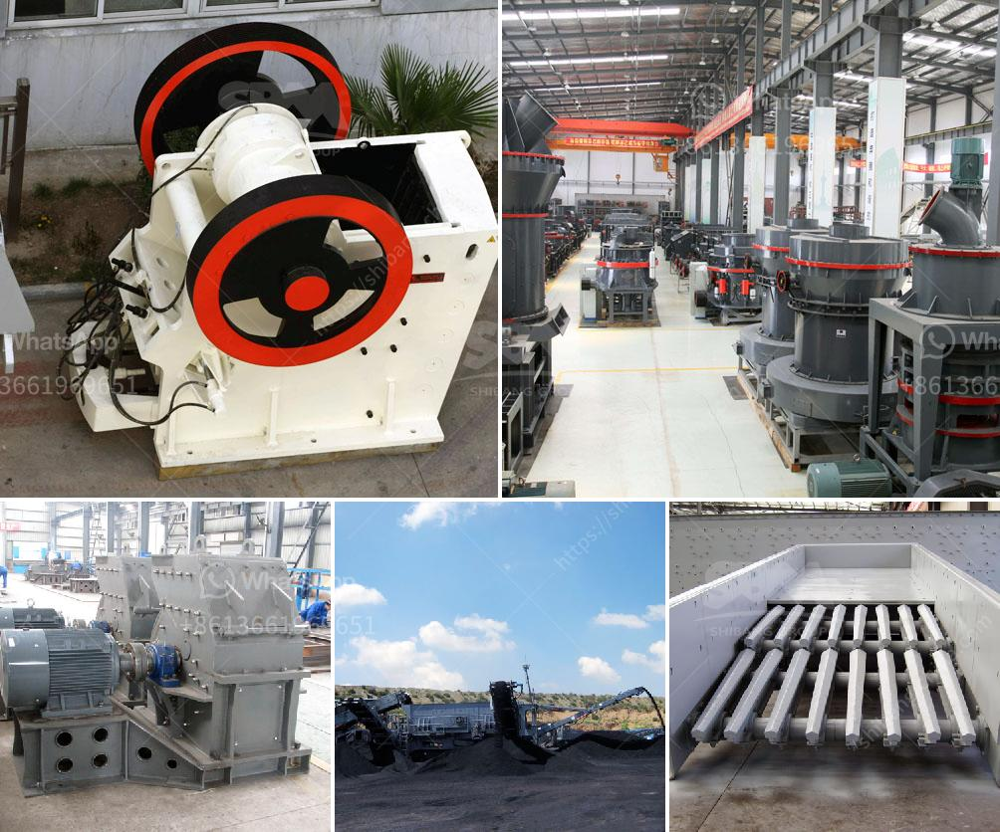

<h3>mode of oeration of a gyratory crusher</h3>
A gyratory crusher is an ore processing machine that crushes the ore between an eccentrically mounted cone and a crushing throat that is fixed. In mining, the most important criteria for effective crushing of oresis to choose the type of crusher that suits the rock (ore) material and to ensure uniform feed.

Gyratory crushers are known for their high production rates, with a higher capacity than a jaw crusher. In order to get cubical material out of a gyratory crusher, it should be choke fed. Gyratory crushers are not suitable for crushing clay, as clay will clog the crusher.

Gyratory crushers consist of a shell, which is sloping inwards, and a long spindle that is suspended from a bar at the top with the help of pivots. At the bottom of the crusher, the spindle is mounted atop an eccentric sleeve that enables spindle movement in a conical path around the shell.

The cone crusher is very similar to the gyratory crusher in terms of operation, but it has a much shorter spindle with a larger diameter crushing surface relative to its length. The vertical spindle is free to rotate around its own axis but is guided by the eccentric in the gyratory crusher.

As the material enters the crusher, it is crushed between the spindle and the concave. Each of these surfaces are lined with wear-resistant steel plates or hard rock resistant steel plates, known as mantles and concaves, respectively. The rock material is crushed by the eccentric movement of the mantle against the concave, which ensures that the rock material is crushed progressively smaller and smaller until it is small enough to pass through the gap at the bottom of the crusher.

One of the main advantages of the gyratory crusher is that it has a steady movement for crushing, unlike jaw crushers that have a swing movement. This allows the crusher to handle more hard and abrasive rocks. Additionally, a gyratory crusher also consumes less power and has a higher processing capacity than a jaw crusher.

The gyratory crusher is a versatile and effective crushing solution that is used in various industries. With proper maintenance and care, gyratory crushers are capable of enduring years of continuous operation, allowing you to achieve the highest levels of efficiency and productivity in your mining operations.
<h3>Contact us</h3><ul><li><strong>Whatsapp:&nbsp;<a href="https://wa.me/8613661969651">+8613661969651</a></strong></li><li><a href="https://swt.shibang-china.com/?git&amp;zhl&amp;mode of oeration of a gyratory crusher"><strong>Online Service(chat now)</strong></a></li></ul><h3>Related</h3><ul><li><a href='crusher plant price in ethiopia.md'>crusher plant price in ethiopia</a></li><li><a href='coal mining crusher malaysia.md'>coal mining crusher malaysia</a></li><li><a href='estimated cost of building a steel mill.md'>estimated cost of building a steel mill</a></li><li><a href='quarry crusher machine usa.md'>quarry crusher machine usa</a></li><li><a href='cone crusher price in china.md'>cone crusher price in china</a></li></ul>