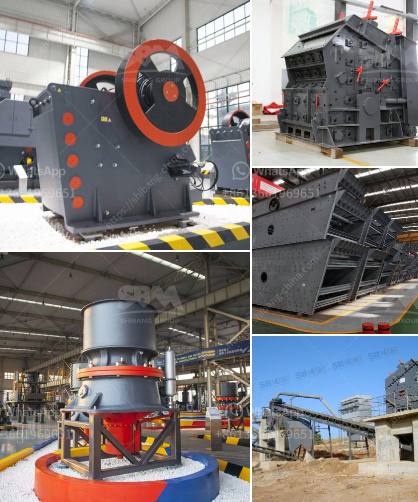

<h3>model ball mill</h3>
A ball mill, a type of grinder, is a cylindrical device used in grinding (or mixing) materials like ores, chemicals, ceramic raw materials, and paints. Ball mills rotate around a horizontal axis, partially filled with the material to be ground plus the grinding medium. Different materials are used as media, including ceramic balls, flint pebbles, and stainless steel balls. An internal cascading effect reduces the material to a fine powder, which is then used for further processing.

There are several factors to consider when selecting a ball mill, including the properties of the material being ground, the speed of the rotation, the size of the grinding media, and the desired fineness of the final product. A model ball mill is a good option for smaller-scale operations or laboratories, where only a small amount of material needs to be processed.

One example of a model ball mill is the Retsch PM 100, which is designed to grind and mix small batches of materials. This compact and lightweight mill has a maximum speed of 650 rpm and can handle up to 1,250 mL of suspension or 1 gram of hard materials. The grinding jars, which are made of stainless steel, have a capacity of 50 mL each, making it suitable for various applications.

The Retsch PM 100 features a digital display that shows the speed and time settings, allowing for more precise control over the grinding process. The mill also has a safety feature: it will not start until the jar is securely in place, preventing accidents and ensuring user safety.

The model ball mill is equipped with a powerful motor that generates enough energy to efficiently grind and mix materials. It uses a planetary movement, where the grinding jars rotate on their own axis in opposite directions, creating a strong centrifugal force. This force combined with the grinding media produces high impact and friction, resulting in a fine powder.

With its compact size and user-friendly design, the model ball mill is easy to operate and clean. It is suitable for a wide range of applications, such as grinding, homogenizing, and mixing. Common uses include preparing samples for analysis, pulverizing biological materials, and producing nanomaterials. The mill can be used with dry or wet materials, making it versatile and adaptable to different laboratory needs.

In conclusion, a model ball mill is a valuable tool for grinding, mixing, and homogenizing small batches of materials in laboratories or small-scale operations. Its compact size, ease of use, and safety features make it a reliable choice for various applications. Whether you are a researcher, scientist, or student, a model ball mill can help you achieve the desired fineness and quality of your end product.
<h3>Contact us</h3><ul><li><strong>Whatsapp:&nbsp;<a href="https://wa.me/8613661969651">+8613661969651</a></strong></li><li><a href="https://swt.shibang-china.com/?git&amp;zhl&amp;model ball mill"><strong>Online Service(chat now)</strong></a></li></ul><h3>Related</h3><ul><li><a href='limestone grinding raymond mill.md'>limestone grinding raymond mill</a></li><li><a href='ball india ball mills 220 tph.md'>ball india ball mills 220 tph</a></li><li><a href='calcium carbide production machinery.md'>calcium carbide production machinery</a></li><li><a href='second hand mobile jaw crusher in spain.md'>second hand mobile jaw crusher in spain</a></li><li><a href='jaw stone crusher zimbabwe.md'>jaw stone crusher zimbabwe</a></li></ul>