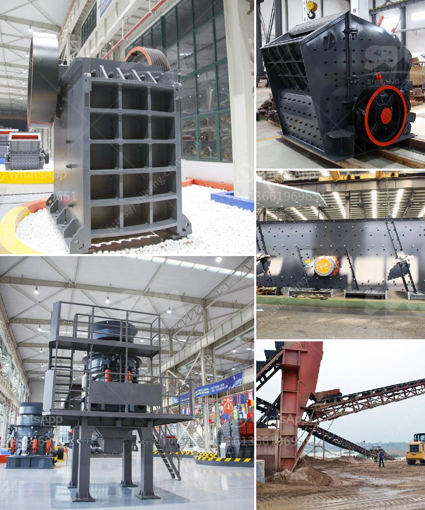

<h3>movable crushing plant</h3>
A crushing plant is an essential part of any quarry or mining operation. It is used to crush various types of raw materials into smaller sizes to be used in construction and other industries. There are different types of crushing plants, and one popular option is the movable crushing plant.

A movable crushing plant, also known as a mobile crushing plant, offers flexibility and convenience for construction waste crushing, stone crushing, and other types of minerals processing. It provides the feasibility for portable crushing and screening of various materials like granite, limestone, quartz, basalt, ore, coal, and more.

The main advantage of a movable crushing plant is its ability to transport on highways, railways, and other roads. It can also move on rugged terrains and reduce transportation costs. The plant is mounted on tracks or wheels, allowing it to be easily moved from one site to another. This makes it ideal for construction projects in remote or rural areas.

A movable crushing plant also provides greater flexibility in terms of the crushing process. It can be adjusted according to the material type and desired final product size. The plant can be equipped with various crushers, such as jaw crushers, cone crushers, impact crushers, and vertical shaft impact crushers, depending on the application requirements.

Another advantage of a movable crushing plant is its quick setup time. Unlike fixed crushing plants that require significant construction work and time, a movable plant can be set up within hours. This allows for faster production and reduces downtime. It is especially beneficial for contractors who need to move frequently between different construction sites.

Furthermore, a movable crushing plant is equipped with advanced automation features. This allows for remote monitoring and control of the plant's operation. Operators can monitor crucial parameters like fuel consumption, crusher load, and production rates from a control room or via a mobile device. It enhances the safety and efficiency of the crushing process.

In addition to its mobility and flexibility, a movable crushing plant offers environmental benefits. With stricter regulations on dust and noise pollution, crushing plants need to comply with environmental standards. A movable plant often comes with features like dust suppression systems and noise reduction measures to ensure compliance with these regulations.

To summarize, a movable crushing plant offers several advantages over fixed crushing plants. Its mobility and flexibility allow for easy transportation, rapid setup, and quick adjustment for different materials and applications. It also provides advanced automation features for remote monitoring and control. Additionally, it is environmentally friendly with reduced dust and noise emissions. Whether for quarrying, mining, or construction projects, a movable crushing plant is a valuable investment for efficient and sustainable operations.
<h3>Contact us</h3><ul><li><strong>Whatsapp:&nbsp;<a href="https://wa.me/8613661969651">+8613661969651</a></strong></li><li><a href="https://swt.shibang-china.com/?git&amp;zhl&amp;movable crushing plant"><strong>Online Service(chat now)</strong></a></li></ul><h3>Related</h3><ul><li><a href='working principle of conveyor belt.md'>working principle of conveyor belt</a></li><li><a href='gypsum import from bhutan.md'>gypsum import from bhutan</a></li><li><a href='vertically roller mill pakistan.md'>vertically roller mill pakistan</a></li><li><a href='what is cost for 50 tpd cement plant.md'>what is cost for 50 tpd cement plant</a></li><li><a href='feldspar grinding mill suppliers india.md'>feldspar grinding mill suppliers india</a></li></ul>