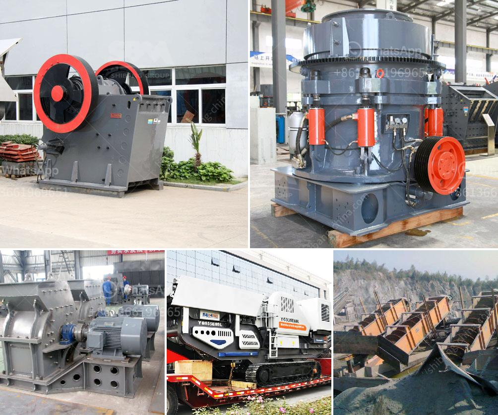

<h3>mtm 160 mill spare parts suppliers in india</h3>
India is a rapidly growing economy with a booming industrial sector. As more industries become established in the country, there is an increasing demand for high-quality machinery and equipment. One such machinery is the MTM 160 mill, which is widely used in various industries, including mining, construction, and chemical manufacturing. To ensure uninterrupted operations and optimal performance, having access to reliable spare parts suppliers is crucial.

The MTM 160 mill is a high-efficiency grinding machine that produces fine powder materials. It is widely used in industries such as metallurgy, mining, chemical engineering, cement, construction, and other industrial fields. This versatile equipment can grind limestone, calcite, dolomite, barite, talc, gypsum, diabase, quartz, bentonite, and many more materials.

Given the widespread usage of the MTM 160 mill in India, it is essential to have reliable suppliers for spare parts. These parts can include grinding roller assemblies, grinding roller shafts, bearings, springs, gearboxes, and other components that may wear out or require replacement over time. Timely availability of these spare parts is crucial for minimizing downtime and ensuring the uninterrupted operation of the mill.

Fortunately, there are various suppliers in India dedicated to providing high-quality spare parts for the MTM 160 mill. These suppliers understand the specific requirements of the machinery and have extensive knowledge of the mill's components. They maintain a comprehensive inventory of genuine, OEM spare parts, manufactured to the highest standards, ensuring compatibility and optimal performance.

These suppliers offer a wide range of spare parts to meet the diverse needs of different industries. They maintain a user-friendly online platform where customers can browse through their catalogue of spare parts and place orders conveniently. Additionally, their customer service teams are readily available to answer any inquiries, provide technical support, and ensure a smooth purchasing experience.

When sourcing spare parts for the MTM 160 mill, it is essential to choose reliable suppliers who value quality and customer satisfaction. Reputed suppliers have stringent quality control processes in place, ensuring that all spare parts meet industry standards and specifications. By partnering with such suppliers, customers can have peace of mind knowing that their machinery's performance, efficiency, and durability are maintained.

In conclusion, as the demand for the MTM 160 mill increases in various industries in India, it is crucial to have access to reliable spare parts suppliers. These suppliers play a crucial role in ensuring the seamless operation of the machinery by providing high-quality, genuine spare parts. With their expertise and commitment to customer satisfaction, they contribute to the growth and success of industries relying on the MTM 160 mill. By choosing reputable suppliers, businesses can minimize downtime, enhance productivity, and achieve their manufacturing goals.
<h3>Contact us</h3><ul><li><strong>Whatsapp:&nbsp;<a href="https://wa.me/8613661969651">+8613661969651</a></strong></li><li><a href="https://swt.shibang-china.com/?git&amp;zhl&amp;mtm 160 mill spare parts suppliers in india"><strong>Online Service(chat now)</strong></a></li></ul><h3>Related</h3><ul><li><a href='portable crusher in malaysia.md'>portable crusher in malaysia</a></li><li><a href='ballast crusher price.md'>ballast crusher price</a></li><li><a href='sand manufacturing small scale.md'>sand manufacturing small scale</a></li><li><a href='second hand ball mill manufacturer in india.md'>second hand ball mill manufacturer in india</a></li><li><a href='ball mill manufactures in zimbabwe.md'>ball mill manufactures in zimbabwe</a></li></ul>