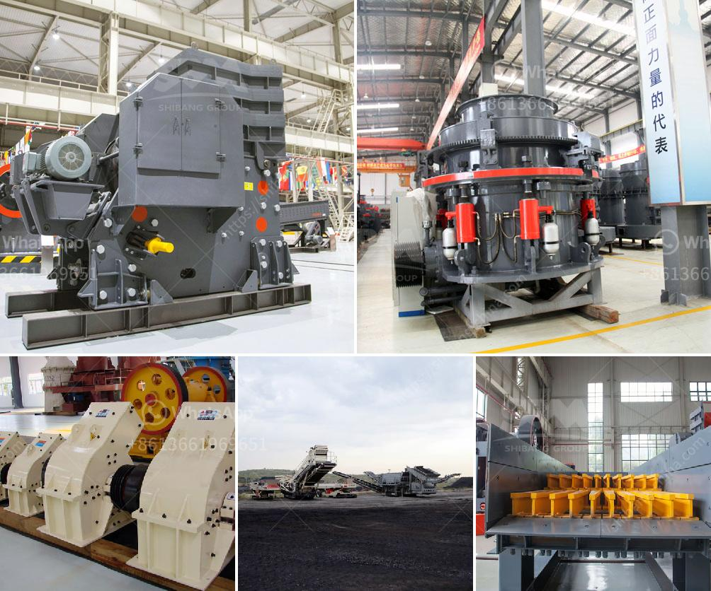

<h3>mtm grinding mill</h3>
Grinding mills play a crucial role in countless industrial sectors. They are used to grind materials into desired sizes for further processing, enhancing productivity and delivering better end products. Among the vast range of grinding mills available in the market, the MTM Grinding Mill stands out for its high efficiency, reliability, and versatility.

The MTM Grinding Mill, also known as Medium Speed Trapezium Mill, is a leading world-level industrial mill. This well-designed and robust mill offers numerous benefits to industries, making it a top choice for grinding various materials. 

One of the key advantages of the MTM Grinding Mill is its efficiency. It features a highly efficient centrifugal blower, which ensures that materials are rapidly and uniformly ground. This not only saves time but also energy, making the mill cost-effective in the long run. 

Reliability is another significant aspect of the MTM Grinding Mill. Built with high-quality materials and designed to withstand heavy usage, this mill guarantees long-term performance without frequent maintenance or breakdowns. Industries can rely on this mill for uninterrupted grinding operations and avoid costly downtime.

Versatility is yet another compelling feature of the MTM Grinding Mill. It can efficiently grind a wide range of materials, including limestone, quartz, feldspar, calcite, talc, barite, clay, and more. This makes it suitable for various industries such as mining, metallurgy, construction, chemical engineering, and cement production, among others.

In conclusion, when it comes to industrial grinding needs, the MTM Grinding Mill is a reliable and efficient choice. Its exceptional features, including high efficiency, reliability, and versatility, make it a valuable asset for industries across the globe. Whether for fine or ultra-fine grinding, this mill delivers outstanding performance, ensuring enhanced productivity and superior end products. Invest in the MTM Grinding Mill for a reliable and efficient grinding solution that will take your industrial processes to the next level.
<h3>Contact us</h3><ul><li><strong>Whatsapp:&nbsp;<a href="https://wa.me/8613661969651">+8613661969651</a></strong></li><li><a href="https://swt.shibang-china.com/?git&amp;zhl&amp;mtm grinding mill"><strong>Online Service(chat now)</strong></a></li></ul><h3>Related</h3><ul><li><a href='simple formula for belt conveyor.md'>simple formula for belt conveyor</a></li><li><a href='diamond jaw crusher usa.md'>diamond jaw crusher usa</a></li><li><a href='model ball mill.md'>model ball mill</a></li><li><a href='jaw crusher what price in china.md'>jaw crusher what price in china</a></li><li><a href='roller mill for muradabad.md'>roller mill for muradabad</a></li></ul>