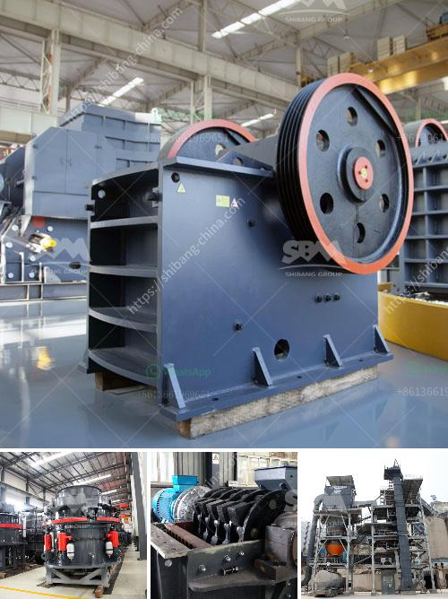

<h3>new quartz plant cost in india</h3>
India is witnessing a surge in the demand for quartz plants, leading to the establishment of new manufacturing units across the country. Quartz plants are crucial for producing high-quality quartz slabs used in various applications like kitchen countertops, flooring, and wall claddings. These plants are designed to process raw quartz into refined slabs with precision and efficiency.

The cost of setting up a new quartz plant in India can vary depending on its capacity and the level of automation. On average, a small-scale plant with a capacity of producing around 50,000 square feet of quartz slabs per year may require an initial investment ranging from INR 1 crore to INR 2 crores. This includes the cost of machinery, land, building, utilities, and labor.

For larger plants with a capacity of producing 100,000 to 150,000 square feet of quartz slabs annually, the investment can range between INR 2 crores to INR 4 crores. These plants usually employ advanced machinery and automation systems, ensuring higher productivity and reducing labor costs.

It's important to note that apart from the initial setup cost, there are also ongoing expenses involved in running a quartz plant. These include raw material procurement, energy costs, maintenance, marketing, and labor wages. However, with the growing demand for quartz and the increasing popularity of quartz-based surfaces, the return on investment can be significant.

The government of India has also taken various initiatives to promote the manufacturing sector, including subsidies, tax incentives, and favorable policies. These measures aim to encourage new investments in the quartz industry and boost domestic production.

The establishment of new quartz plants in India not only meets the rising domestic demand but also opens doors for international exports. With India's abundant reserves of high-quality quartz, it has the potential to become a major global supplier, further enhancing the country's economy.

In conclusion, the cost of setting up a new quartz plant in India can vary depending on its capacity and automation level. However, with the growing demand and government support, investing in a quartz plant can prove to be a lucrative venture for entrepreneurs in India.
<h3>Contact us</h3><ul><li><strong>Whatsapp:&nbsp;<a href="https://wa.me/8613661969651">+8613661969651</a></strong></li><li><a href="https://swt.shibang-china.com/?git&amp;zhl&amp;new quartz plant cost in india"><strong>Online Service(chat now)</strong></a></li></ul><h3>Related</h3><ul><li><a href='mini sand stone crusher price.md'>mini sand stone crusher price</a></li><li><a href='crusher in china.md'>crusher in china</a></li><li><a href='fly ash grinding machine manufacturar in india.md'>fly ash grinding machine manufacturar in india</a></li><li><a href='used rock fine crusher for sale.md'>used rock fine crusher for sale</a></li><li><a href='ball milling in spray preparation.md'>ball milling in spray preparation</a></li></ul>