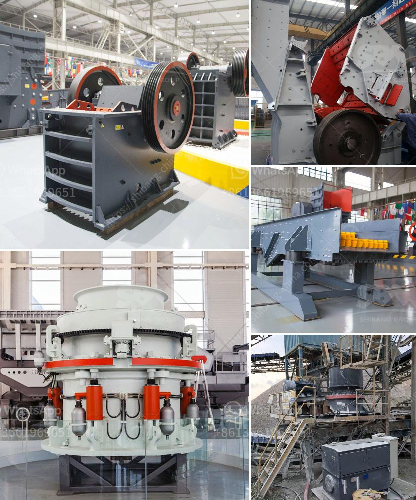

<h3>new small gold processing equipment for sale in usa</h3>
Title: Modernizing the Gold Mining Industry: New Small-Scale Gold Processing Equipment for Sale in the USA

Gold mining remains a key industry in the United States today. It plays a crucial role in the domestic economy, as it supports thousands of jobs and boosts local economies in gold-rich regions. With advancements in technology, small-scale gold processing equipment is now more accessible and efficient than ever before. In this article, we will explore the latest trends in gold processing equipment available for sale in the USA, and how these advancements are revolutionizing the industry.

Traditionally, gold mining techniques relied heavily on manual labor, involving meticulous panning and sluicing to extract the precious metal. However, advancements in technology have led to the development of innovative equipment designed to streamline the process while increasing productivity and minimizing environmental impact.

1. Centrifugal Concentrators: One of the key developments in small-scale gold processing equipment is the emergence of centrifugal concentrators. These machines utilize high-speed rotation to separate gold particles from lighter materials effectively. Centrifugal concentrators can process larger volumes of material, reducing labor requirements and increasing overall gold recovery rates.

2. Cyanide-Free Gold Recovery Systems: With growing environmental concerns, there is an increasing demand for gold processing equipment that is both efficient and eco-friendly. Cyanide-free gold recovery systems have gained popularity in recent years. Alternatives, such as thiosulfate leaching, offer a safer and more sustainable method for extracting gold, reducing the environmental impact associated with traditional cyanide-based processes.

3. Modular Processing Plants: To cater to smaller-scale operations, modular gold processing plants have gained traction in the market. These plants are designed to be transportable and can be easily assembled or disassembled as needed. Equipped with advanced technology and automated systems, modular plants offer a cost-effective solution for small-scale gold miners who want to increase their production without large capital investments.

4. Advanced Sensor-Based Sorting Systems: Another noteworthy advancement in gold processing equipment is the use of sensor-based sorting technology. By utilizing various sensors, such as X-rays and infrared cameras, these systems can detect and sort valuable minerals based on their specific characteristics, significantly improving efficiency and reducing processing costs.

The availability of these new small-scale gold processing equipment technologies benefits both miners and the industry as a whole. With lower capital investment and higher gold recovery rates, miners are able to achieve profitable operations with relatively low overhead. Moreover, the reduced environmental impact promotes sustainable practices and helps the industry align with stricter regulations on mining standards.

As the gold mining industry continues to evolve, technological advancements in small-scale gold processing equipment have revolutionized the way the industry operates. From centrifugal concentrators to cyanide-free gold recovery systems, these advancements are not only increasing efficiency and productivity but also promoting sustainable mining practices. The availability of such advanced equipment in the USA opens up opportunities for small-scale miners to thrive in a competitive market. Embracing these advancements will undoubtedly facilitate the growth and modernization of the gold mining industry in the United States.
<h3>Contact us</h3><ul><li><strong>Whatsapp:&nbsp;<a href="https://wa.me/8613661969651">+8613661969651</a></strong></li><li><a href="https://swt.shibang-china.com/?git&amp;zhl&amp;new small gold processing equipment for sale in usa"><strong>Online Service(chat now)</strong></a></li></ul><h3>Related</h3><ul><li><a href='hammer mill aluminum slag.md'>hammer mill aluminum slag</a></li><li><a href='cde sand washing plant price.md'>cde sand washing plant price</a></li><li><a href='100tpd cement mill manufacturers.md'>100tpd cement mill manufacturers</a></li><li><a href='brick crusher for sale.md'>brick crusher for sale</a></li><li><a href='mobile aggregate plant for sale in the philippines.md'>mobile aggregate plant for sale in the philippines</a></li></ul>