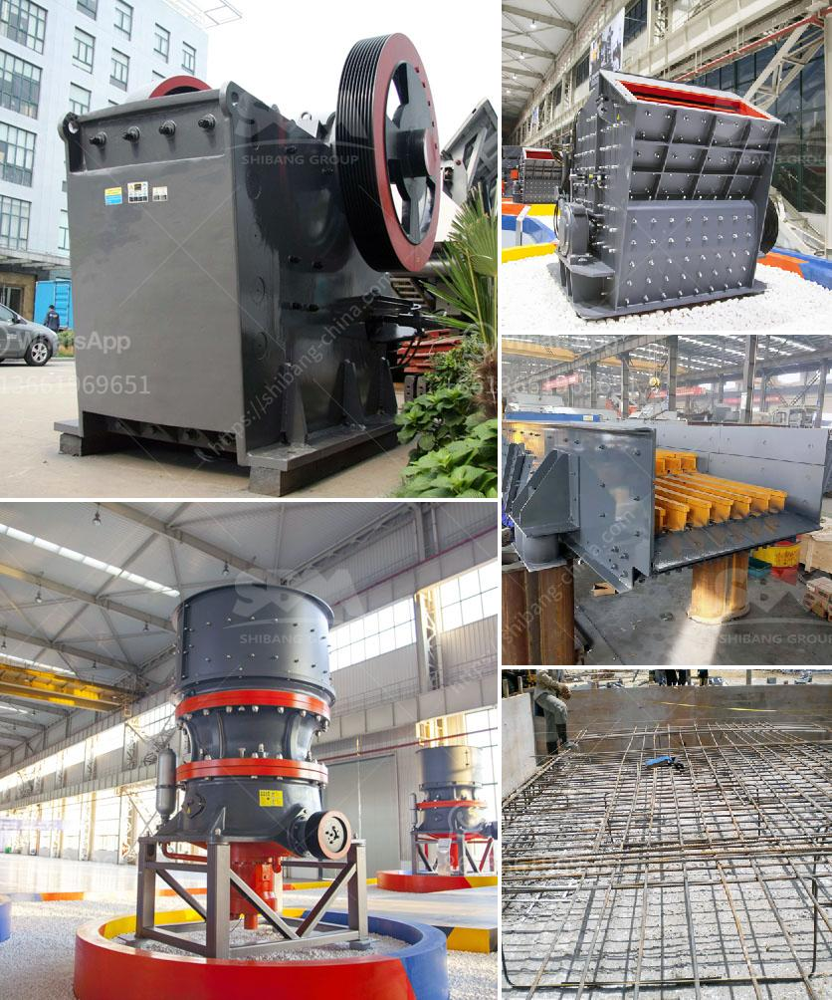

<h3>new technology stone crusher</h3>
The stone crusher is a piece of indispensable equipment for the stone crushing line, Which can be used for primary, secondary and fine crushing of more than 200 kinds of rough stones such as granite, basalt, limestone, rock, concrete, aggregate, gravel, dolomite and quartz.

In recent years, with the rapid expansion of the economy and the ongoing construction projects, stone crusher equipment has become the key equipment in production of building aggregates. The new technology of stone crusher is the stone crusher produced by the famous manufacturer Fote Machinery, introduced and absorbed the most advanced technology from Europe. It is a product of combining the specific industrial and mining conditions of the domestic sand and gravel industry.

It is developed on the basis of introducing foreign outstanding technology, and its research and development level is in the leading position in China. With the development of stone crushing technology, a mountain of stone production of hundreds of years ago is gradually being replaced. The development of new technology stone crusher not only leads the industry in innovation, but also improves the overall production technology to a new level. What can be done if one invests in a new technology stone crusher? New technology stone crusher is mainly used for various types of stone crushing operations. According to the different principles of broken and particle size, into many types, PE jaw crusher, PEW jaw crusher, PF impact crusher, PFW impact crusher, HPT hydraulic cone crusher, CS cone crusher, py spring cone crusher, and other eight series of dozens of specifications, with various types of high yield and high yield broken. It can also be configured with cone crusher according to the actual needs of customers.

The new technology stone crusher is more durable, better shockproof and lower equipment failure rate. It has been widely used in buildings, more and more customers have been served in the stone production line. With the development of technology, more and more new technology stone crusher machines have appeared on the market, such as mobile stone crusher machines. With high performance and convenient operation, mobile stone crusher machines are more popular among users. In addition, the mobile stone crusher machine is widely used in various industries, such as ore crushing, railway, highway, energy, cement, chemistry, etc.

As the leading manufacturer and supplier of stone crusher machine, Fote Machinery offers popular stone crushers with favourable and competitive price. For more details, please visit our website or contact us directly.
<h3>Contact us</h3><ul><li><strong>Whatsapp:&nbsp;<a href="https://wa.me/8613661969651">+8613661969651</a></strong></li><li><a href="https://swt.shibang-china.com/?git&amp;zhl&amp;new technology stone crusher"><strong>Online Service(chat now)</strong></a></li></ul><h3>Related</h3><ul><li><a href='manganese mobile processing plants.md'>manganese mobile processing plants</a></li><li><a href='vibrating grizzly feeder 35 ton per jam.md'>vibrating grizzly feeder 35 ton per jam</a></li><li><a href='roller raymond mill.md'>roller raymond mill</a></li><li><a href='production of iron ore and manganese.md'>production of iron ore and manganese</a></li><li><a href='cone crusher working.md'>cone crusher working</a></li></ul>