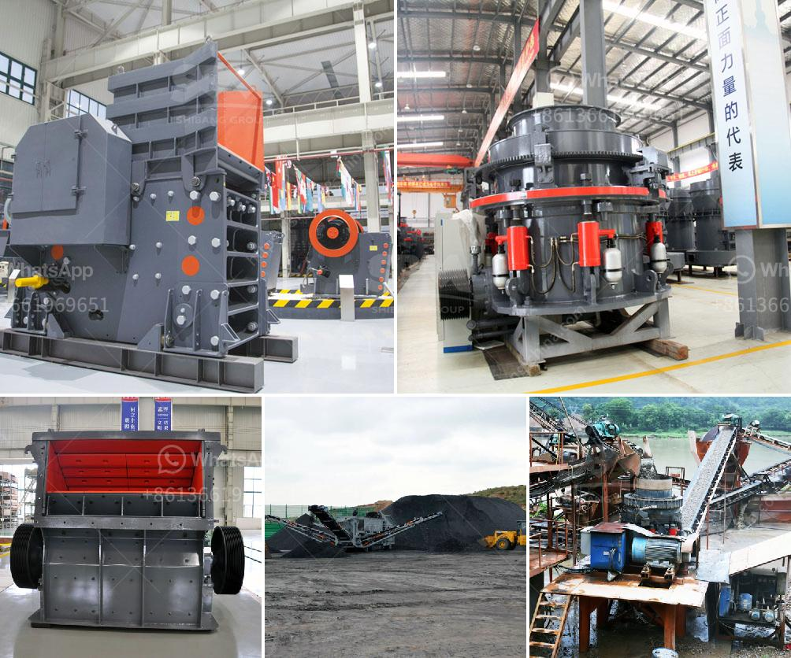

<h3>new trends in concrete technology slide presentation</h3>
Concrete is one of the most widely used construction materials globally, known for its durability and strength. However, as technology continues to advance, the world of concrete is experiencing a paradigm shift. Developers are leveraging innovative materials and techniques to enhance the properties of concrete, making it more sustainable, stronger, and aesthetically appealing. In this article, we will explore some emerging trends in concrete technology that are reshaping the construction industry.

One of the most exciting developments in concrete technology is self-healing concrete. This innovative material is designed to repair its own cracks autonomously, significantly extending the lifespan of structures. Self-healing concrete employs the inclusion of capsules or bio-based materials that release healing agents when cracks occur. This technology has the potential to save on costly maintenance and repair work, ensuring infrastructure remains functional and safe for extended periods.

Ultra-High-Performance Concrete (UHPC) is quickly gaining popularity due to its remarkable strength and versatility. UHPC contains a high density of fine particles, superplasticizers, fibers, and special additives that enhance its mechanical properties. This type of concrete possesses exceptional compressive strength, durability, and resistance to corrosion, making it suitable for a wide range of applications, including skyscrapers, bridges, and offshore structures.

3D printing has made its way into the construction industry, revolutionizing the way structures are built. With 3D-printed concrete, intricate shapes and designs can be easily fabricated, reducing labor-intensive processes. This technology allows for the optimization of material usage, minimizing waste, and reducing environmental impacts. Additionally, it enables the construction of more complex and efficient structures, presenting endless possibilities for architectural creativity.

Traditionally, concrete has been associated with its characteristic gray color and opaque appearance. However, a breakthrough called transparent concrete is pushing the boundaries of design possibilities. Transparent concrete is created by embedding optical fiber grids within the concrete mix, allowing light to transmit through the material. This enchanting development opens up new opportunities for innovative designs in architecture, enabling the creation of translucent walls and facades that break away from conventional aesthetics.

The concrete industry is known for its significant carbon footprint due to the production process. However, recent advancements have sparked new methods to capture and reuse carbon dioxide emissions during concrete production. By injecting captured CO2 into the concrete mix, the material gains additional strength and durability while reducing its environmental impact. This technology not only contributes to the reduction of greenhouse gases but also enhances the overall quality of concrete.

The emergence of new trends in concrete technology represents a significant shift in the construction industry. Through advancements in materials and techniques, developers are able to create more sustainable, durable, and aesthetically appealing structures. Self-healing concrete, ultra-high-performance concrete, 3D-printed concrete, transparent concrete, and carbon capture utilization are just a few examples of the exciting developments reshaping the world of concrete. As technology continues to evolve, the possibilities for innovation in this field are endless. These advancements will undoubtedly enhance our built environment, ushering in a new era of sustainable and resilient construction.
<h3>Contact us</h3><ul><li><strong>Whatsapp:&nbsp;<a href="https://wa.me/8613661969651">+8613661969651</a></strong></li><li><a href="https://swt.shibang-china.com/?git&amp;zhl&amp;new trends in concrete technology slide presentation"><strong>Online Service(chat now)</strong></a></li></ul><h3>Related</h3><ul><li><a href='rock salt processing plant.md'>rock salt processing plant</a></li><li><a href='raymond mill company.md'>raymond mill company</a></li><li><a href='iron ore 100 150tph belt conveyor price.md'>iron ore 100 150tph belt conveyor price</a></li><li><a href='mobile crusher sale.md'>mobile crusher sale</a></li><li><a href='mobile crushing stone machines from austria.md'>mobile crushing stone machines from austria</a></li></ul>