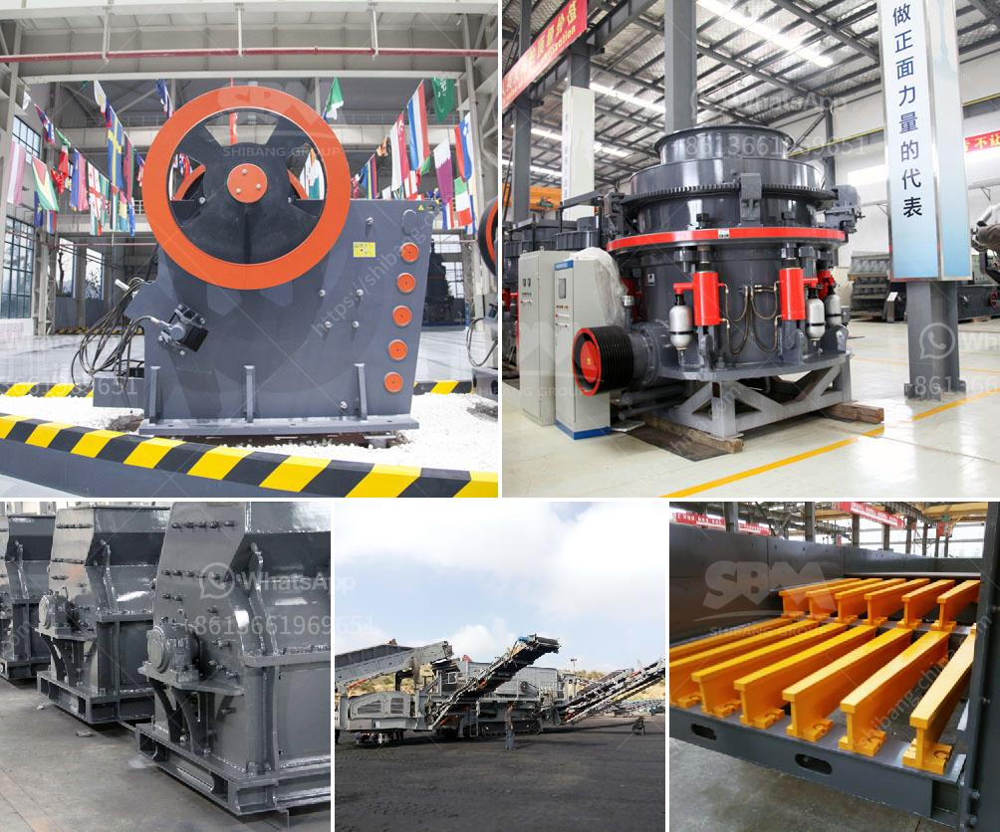

<h3>nigeria granite crushers</h3>
Nigeria is richly endowed with granite stone and other related solid minerals like Marble, Dolomite, and Basalt. It is found in commercial quantities in different parts of the country, mainly in the southwestern and middle belt regions. Granite is a popular building material and is commonly used for paving, countertops, flooring, and landscaping.

Granite crushers are essential in the granite stone crushing industry. Like the name suggests, these crushers help in the crushing of granite into useful forms for various construction purposes. Granite is an igneous rock formed by the cooling of magma beneath the Earth's surface. It is composed mainly of quartz and feldspar minerals, with small amounts of mica and other minerals.

The granite crushers in Nigeria are designed to handle a wide range of crushing applications, from primary, secondary, and tertiary hard rock crushing to mixed demolition debris, crushed or broken concrete and asphalt, sand & gravel and quarried stone. Stationary and portable plants are available.

Granite crushers come in various sizes and capacities. Crushers can also be customized into different types; electric, diesel, or hydraulic-driven. granite crushing machines in Nigeria suitable for crushing soft or hard rocks and ores such as iron ore, limestone, slag, marble, quartz, granite, cement, clinker, and so on.

Granite crushers in Nigeria do the job of crushing, screening, and blending the granite aggregates, thereby reducing the cost of infrastructure development. The maintenance practices of these machines are also an important consideration for better output within the Nigerian context.

To achieve optimum performance and extended lifespan of granite crushers in Nigeria, regular maintenance and servicing are crucial. The machines should be kept clean and free from any debris, as this can impact its efficiency and output. Lubrication of all moving parts should be done according to the manufacturer's recommendations to prevent premature wear and tear.

Granite crushers in Nigeria play a significant role in the construction industry. Nigeria has abundant granite reserves and it is widely used in construction and decoration. Additionally, it is an essential raw material in the production of cement and asphalt.

The demand for granite in Nigeria has been on the rise due to major infrastructural projects being undertaken by the government. These projects include the construction of roads, bridges, dams, airports, and housing estates. As a result, the demand for granite aggregates is continuously increasing, leading to the need for more advanced and efficient granite crushers.

In conclusion, granite crushers in Nigeria are essential in the construction industry. They help in the crushing of granite into useful forms that can be used for various construction purposes. The demand for granite continues to rise in Nigeria, necessitating the need for advanced and efficient granite crushers to meet the increasing demand. Regular maintenance and servicing are crucial to achieve optimum performance and prolonged lifespan of these machines.
<h3>Contact us</h3><ul><li><strong>Whatsapp:&nbsp;<a href="https://wa.me/8613661969651">+8613661969651</a></strong></li><li><a href="https://swt.shibang-china.com/?git&amp;zhl&amp;nigeria granite crushers"><strong>Online Service(chat now)</strong></a></li></ul><h3>Related</h3><ul><li><a href='stone crusher for sale in zimbabwe.md'>stone crusher for sale in zimbabwe</a></li><li><a href='gypsum machine in germany.md'>gypsum machine in germany</a></li><li><a href='cone crusher working.md'>cone crusher working</a></li><li><a href='buy sand washing plant in sri lanka.md'>buy sand washing plant in sri lanka</a></li><li><a href='impact crusher for sale philippines.md'>impact crusher for sale philippines</a></li></ul>