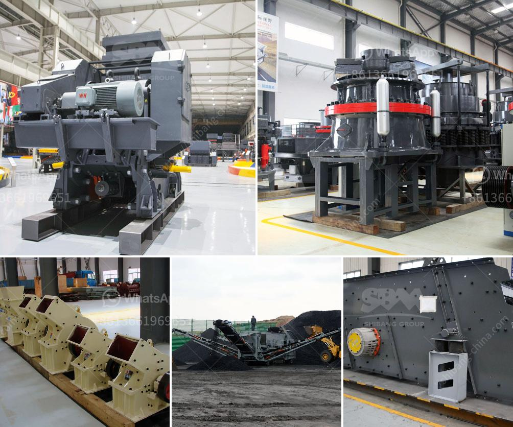

<h3>nigeria grinding mills price</h3>
Grinding mills are a fundamental necessity in the agricultural and industrial sectors of Nigeria. With the growing population and increasing demand for food and industrial products, Nigeria's economy heavily relies on its agricultural and manufacturing sectors. Grinding mills play a crucial role in processing raw materials into finished products, making them an essential investment for sustainable development.

In Nigeria, grinding mills are used to grind various raw materials such as grains, beans, tubers, and spices to produce a wide range of food products. These mills are also used in the production of animal feed, textiles, pharmaceuticals, and construction materials. They enhance efficiency and productivity in processing these materials and enable manufacturers to meet the rising demand for their products.

The price of grinding mills in Nigeria varies depending on factors such as the type, capacity, and functionality. Basic models of grinding mills can be purchased at relatively affordable prices, making them accessible to small-scale farmers and entrepreneurs. These mills are capable of grinding grains and other raw materials efficiently, improving food production and reducing wastage.

For larger-scale operations or specialized processing requirements, more advanced grinding mills with higher capacity and enhanced functionality are available at a higher price. These mills are engineered to handle greater workloads and provide more precise grinding results. While they may require a higher initial investment, the long-term benefits in terms of increased production and product quality outweigh the costs.

In recent years, Nigeria has witnessed an increase in the production and consumption of processed food products, leading to a surge in demand for grinding mills. Consequently, the price of these mills has become a crucial consideration for farmers, food processors, and manufacturers. By providing affordable and efficient grinding mills, Nigeria can enhance its food security and stimulate economic growth in the agricultural and manufacturing sectors.

Moreover, investing in grinding mills promotes local industries and creates job opportunities. With the availability of affordable and high-quality grinding mills, small-scale farmers and entrepreneurs can process their crops and raw materials locally, eliminating the need for expensive imports and reducing dependency on foreign products.

In conclusion, the price of grinding mills in Nigeria is a significant factor in driving agricultural and industrial development. They are essential machines for increasing efficiency, productivity, and product quality. By making these mills accessible and affordable, Nigeria can boost its agricultural and manufacturing sectors, improve food security, and promote economic growth. It is crucial for the government, stakeholders, and manufacturers to collaborate and invest in grinding mills to ensure Nigeria's sustainable development.
<h3>Contact us</h3><ul><li><strong>Whatsapp:&nbsp;<a href="https://wa.me/8613661969651">+8613661969651</a></strong></li><li><a href="https://swt.shibang-china.com/?git&amp;zhl&amp;nigeria grinding mills price"><strong>Online Service(chat now)</strong></a></li></ul><h3>Related</h3><ul><li><a href='indonesia jaw crusher.md'>indonesia jaw crusher</a></li><li><a href='companies selling mining equipment in dubai.md'>companies selling mining equipment in dubai</a></li><li><a href='bell finlay crusher prices.md'>bell finlay crusher prices</a></li><li><a href='calcium carbonate pulverizer.md'>calcium carbonate pulverizer</a></li><li><a href='sand washing machine in sri lanka.md'>sand washing machine in sri lanka</a></li></ul>