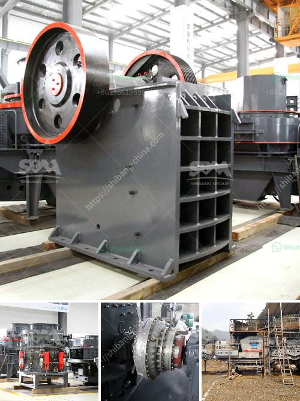

<h3>nigeria stone crusher</h3>
Nigeria is a country blessed with abundant natural resources. It has numerous mineral resources, and most of which are of economic quantity. The main minerals in Nigeria are bauxite, coal, tin, iron ore, columbite, limestone, gold, lead and zinc. Other minerals found in Nigeria includes gypsum, aluminum, lignite, salts, asbestos and so on. The mining of these minerals needs mining equipment, such as crushers, grinding mills, beneficiation equipment, separating equipment and so on.

Among various kinds of mining equipment, crushing equipment, especially jaw crusher, cone crusher and impact crusher play an quite important role. In recent years, the demand for crusher is ever increasing in Nigeria. Cone crusher in Nigeria have great potential market. It is of great importance for Nigerian customers to choose a suitable jaw crusher.

Professional jaw crusher manufacturer provide high quality stone crusher in crushing plant requirements, there are also some other models of jaw crusher for sale, such as PE600×900, PE900×1200 and PE1200×1500. While the capacity range from 15tph -100tph.

Stone crusher with a maximum rated capacity of 200 tons per hour is marketed in Niger and Nigeria on the basis of consultation. The machine has an advantage in the separation of construction waste. In Nigeria, the stone crusher is used to deal with different kinds of materials. There are thousands of crushed stone processing equipment in a variety of environments to meet the needs of almost every kind of mine.

Different types of Nigeria cone crusher can meet different production requirements. The tire cone crusher can also be used separately. For example, the crushing production line can be directly driven to the site and safely put into production. The cone crusher can also handle all kinds of materials. The finished product has uniform particle size and can also be based on The user's production efficiency is adjusted to the best state.

In conclusion, Nigeria stone crusher is a new concept of stone crusher industry. It is advantageous for crushing materials without big hardness and abrasion. This impact crusher can be used in both primary and secondary crushing process. Its angle of impacting face is optimized, which can reduce the excessive fragmentation rate and well-proportioned grain shape of final finished materials.
<h3>Contact us</h3><ul><li><strong>Whatsapp:&nbsp;<a href="https://wa.me/8613661969651">+8613661969651</a></strong></li><li><a href="https://swt.shibang-china.com/?git&amp;zhl&amp;nigeria stone crusher"><strong>Online Service(chat now)</strong></a></li></ul><h3>Related</h3><ul><li><a href='quartz powder ball mill in tamilnadu.md'>quartz powder ball mill in tamilnadu</a></li><li><a href='gypsum crusher plant pdf.md'>gypsum crusher plant pdf</a></li><li><a href='ball mills for mining in china.md'>ball mills for mining in china</a></li><li><a href='hammer mills factories.md'>hammer mills factories</a></li><li><a href='south africa limestone crushing and blending plant.md'>south africa limestone crushing and blending plant</a></li></ul>