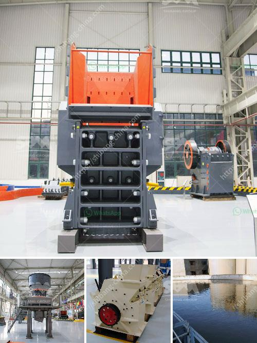

<h3>nip guards on conveyor belts grinding</h3>
Industrial machinery plays a pivotal role in manufacturing and production processes, significantly contributing to the global economy. Conveyor belts are one such essential component that enables automated and efficient material handling in various industries. As these belts operate continuously for extended periods, potential hazards and safety issues may arise if not adequately addressed. One of the important safety features integrated into conveyor belts is the nip guard.

Nip guards are crucial safety devices that can prevent entrapment and injury, particularly when two rollers or belt pulleys come together, creating a narrow gap or "nip" between them. If a worker's body part, clothing, or any other object is caught in this nip point, serious injuries can occur, including severe pinching, crushing, or even amputation. Nip guards are specifically designed to block access to this hazardous area, reducing the risk of accidents and ensuring the safety of workers in industrial settings.

The installation of nip guards on conveyor belts not only complies with safety regulations but also fosters a positive work environment focused on employee well-being. Companies that prioritize workplace safety not only protect their workers but also minimize the risk of costly litigation and reputation damage. By implementing safety measures, such as nip guards, organizations can demonstrate their commitment to the welfare of their employees and create a culture of safety.

Nip guards come in various forms and designs, employing different materials and technologies to mitigate the risks associated with nip points. For instance, some guards consist of fixed barriers that create a physical barrier around the nip point, preventing any unauthorized access. These guards are usually made of robust materials such as metal or reinforced plastic, ensuring durability and long-term effectiveness.

Another type of nip guard utilizes proximity sensors and safety interlocks to detect the presence of an object or person near the nip point. When an object is detected, the conveyor belt is automatically stopped or slowed down, providing ample time for the individual to move away from the hazardous area. This technology enhances safety while maintaining productivity, as it minimizes downtime associated with frequent stoppages.

Regular inspections and maintenance of nip guards are vital to ensure their reliability and effectiveness. Workplace safety managers should conduct routine assessments to identify any potential damage or wear and tear on the nip guards. They should also provide appropriate training to workers regarding the importance of nip guard usage, safe working practices, and emergency procedures.

In conclusion, nip guards are indispensable safety devices that play a crucial role in industrial environments where conveyor belts are utilized. These guards act as a barrier to nip points, effectively preventing accidents and safeguarding workers from potential harm. Companies that prioritize the installation and maintenance of nip guards demonstrate their commitment to workplace safety, contributing to a positive work environment and reducing the risk of accidents. By investing in nip guards, industries can ensure the well-being of their workers while also meeting regulatory requirements.
<h3>Contact us</h3><ul><li><strong>Whatsapp:&nbsp;<a href="https://wa.me/8613661969651">+8613661969651</a></strong></li><li><a href="https://swt.shibang-china.com/?git&amp;zhl&amp;nip guards on conveyor belts grinding"><strong>Online Service(chat now)</strong></a></li></ul><h3>Related</h3><ul><li><a href='industrial uses of white marble powder.md'>industrial uses of white marble powder</a></li><li><a href='iron ore crusher for sale.md'>iron ore crusher for sale</a></li><li><a href='barite machinery production plant.md'>barite machinery production plant</a></li><li><a href='impact crusher pioneer chassis mounted.md'>impact crusher pioneer chassis mounted</a></li><li><a href='portable diamond processing plant supplier.md'>portable diamond processing plant supplier</a></li></ul>