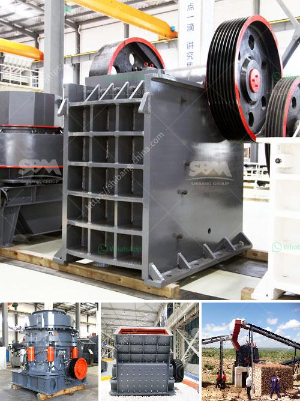

<h3>oman marble quarry companies</h3>
Oman, a picturesque country nestled in the southeastern coast of the Arabian Peninsula, is renowned for its rich cultural heritage and stunning landscapes. One of the nation's most treasured natural resources is its marble, which has been used for centuries in architectural wonders and artistic masterpieces. Oman boasts an array of marble quarry companies dedicated to extracting and showcasing the country's unique and exquisite marbles.

These quarry companies play a crucial role in promoting Oman's marble industry on both domestic and international platforms. Through their expertise and commitment, they unlock the potential of Oman's marble reserves, making them accessible for a wide range of applications. With state-of-the-art machinery and skilled professionals, these companies ensure the extraction process is conducted in a responsible and sustainable manner, harnessing the full potential of this valuable natural resource.

Oman's marble is highly sought after due to its unparalleled quality and unique aesthetics. The marbles found in the Sultanate come in a diverse range of colors, patterns, and finishes, making them suitable for various purposes, from luxurious countertops to stunning interior and exterior facades. Moreover, these marbles are known to withstand environmental factors, making them durable and long-lasting.

By investing in advanced technologies and adopting innovative techniques, Oman's marble quarry companies continually strive to improve the quality and efficiency of their operations. Additionally, they adhere to international industry standards and practices, ensuring that their products meet the highest levels of quality and sustainability.

In recent years, Oman has witnessed significant growth in its marble industry, attracting global attention and establishing itself as a leading player in the international market. The country's marble quarry companies have played a pivotal role in this success, contributing to the nation's economic development and providing employment opportunities for local communities.

Apart from their economic significance, these companies also cherish Oman's rich cultural heritage. They collaborate with talented artists and designers to create unique marble products that showcase the nation's artistic prowess. From breathtaking sculptures to intricate marble inlays, Oman's marble quarry companies bring Oman's cultural heritage to the forefront while promoting the natural beauty of the material.

In conclusion, Oman's marble quarry companies are the driving force behind the country's thriving marble industry. They leverage advanced technologies, uphold sustainable practices, and collaborate with local artisans to unlock the true potential of Oman's marble reserves. As they continue to shape the landscape with their expertise, these companies contribute to the nation's economic growth, preserve its cultural heritage, and promote the natural beauty of Oman's marble worldwide.
<h3>Contact us</h3><ul><li><strong>Whatsapp:&nbsp;<a href="https://wa.me/8613661969651">+8613661969651</a></strong></li><li><a href="https://swt.shibang-china.com/?git&amp;zhl&amp;oman marble quarry companies"><strong>Online Service(chat now)</strong></a></li></ul><h3>Related</h3><ul><li><a href='copper ore concentrator price.md'>copper ore concentrator price</a></li><li><a href='mobile vertical roller mill.md'>mobile vertical roller mill</a></li><li><a href='stone crushing plant supplier south africa.md'>stone crushing plant supplier south africa</a></li><li><a href='crusher for marble.md'>crusher for marble</a></li><li><a href='limestone production machinery.md'>limestone production machinery</a></li></ul>