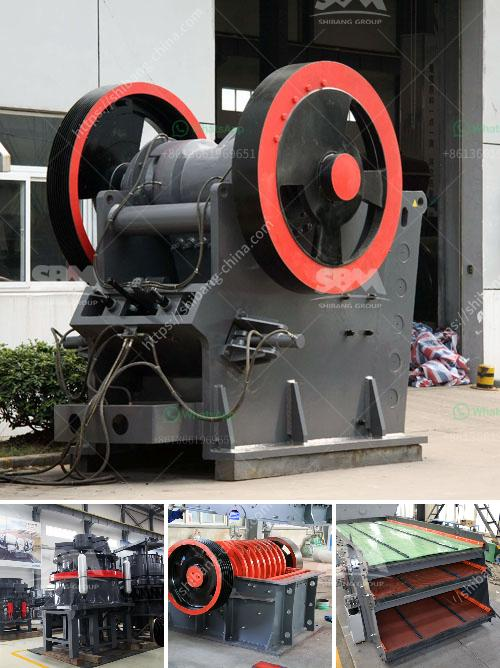

<h3>ominer supplies namibia jaw crushers</h3>
In today's rapidly evolving world, there is an exponential demand for infrastructure development. Construction of roads, buildings, dams, and bridges is at an all-time high. To meet these demands, efficient and reliable crushing equipment is crucial. Ominer Supplies Namibia, a leading supplier of mining and industrial equipment, is helping to drive this growth with its range of jaw crushers.

Jaw crushers have been a basic crushing equipment used in the mining and construction industry for decades. They are compact, reliable, and powerful. The introduction of innovative technology, coupled with advancements in manufacturing processes, has led to the development of high-performance jaw crushers that are capable of crushing even the hardest of materials.

Ominer Supplies Namibia understands the need for robust crushing equipment that can withstand the toughest conditions. Their jaw crushers are designed to deliver exceptional performance even in the harshest mining environments. With a focus on reliability and durability, Ominer jaw crushers are built to last, ensuring optimal operational efficiency and productivity.

One key feature of Ominer's jaw crushers is their versatility. These crushers can handle a wide range of materials, from soft limestone to hard granite and everything in between. This versatility makes them ideal for various applications, such as primary crushing for mining operations, recycling of construction materials, and even in the quarrying industry.

The jaw crushers supplied by Ominer also incorporate cutting-edge technology to enhance performance and safety. Advanced hydraulic systems ensure smooth and precise adjustments, allowing for easy setting changes depending on the desired output size. This provides operators with greater flexibility and control over the crushing process, resulting in more accurate product sizes.

Additionally, Ominer's jaw crushers feature an innovative design that maximizes crushing efficiency. The deep symmetrical crushing chamber and optimized nip angle ensure a smooth and consistent material flow, reducing the chances of blockages and maximizing throughput. This enables faster processing of materials, subsequently increasing productivity.

Safety is of paramount importance in any mining operation, and Ominer's jaw crushers prioritize operator safety. The crushers are equipped with a range of safety features, including a common platform design for easy access and maintenance, guarding to prevent access to moving parts, and emergency stops for instant halting in case of an emergency. This focus on safety ensures the well-being of operators and reduces the risk of accidents.

In conclusion, Ominer Supplies Namibia is revolutionizing the crushing technology industry with its range of jaw crushers. These crushers are designed to deliver exceptional performance, reliability, and durability, making them ideal for various mining and construction applications. With their advanced technology and safety features, Ominer's jaw crushers are setting new industry standards and helping to shape the future of crushing equipment. When it comes to efficient and reliable crushing solutions, Ominer Supplies Namibia is a name you can trust.
<h3>Contact us</h3><ul><li><strong>Whatsapp:&nbsp;<a href="https://wa.me/8613661969651">+8613661969651</a></strong></li><li><a href="https://swt.shibang-china.com/?git&amp;zhl&amp;ominer supplies namibia jaw crushers"><strong>Online Service(chat now)</strong></a></li></ul><h3>Related</h3><ul><li><a href='cheap used quarry machines italy.md'>cheap used quarry machines italy</a></li><li><a href='clay vibrating screen.md'>clay vibrating screen</a></li><li><a href='tonne stone crusher cost sale.md'>tonne stone crusher cost sale</a></li><li><a href='marchine stone crusher cost in kenya.md'>marchine stone crusher cost in kenya</a></li><li><a href='ethiopia unused cone crusher for sale.md'>ethiopia unused cone crusher for sale</a></li></ul>