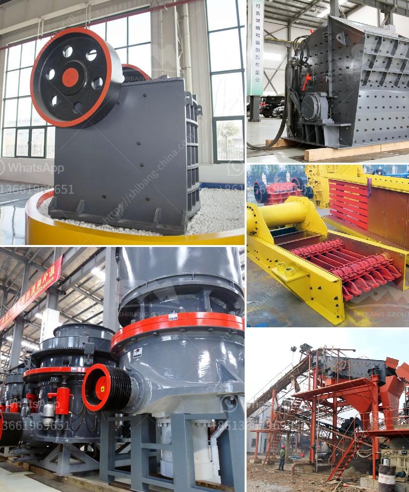

<h3>open cast mining equipment for sale south africa</h3>
Open cast mining equipment is a necessity for any mining project involving large open pits and a big budget. Open cast mining equipment is an essential component of any open-pit mining operation. Whether moving material to a processing plant or dumping overburden, open pit miners rely heavily on equipment to get the job done. When it comes to purchasing the best equipment for your mining project, open cast mining equipment for sale South Africa is the go-to choice for mining entrepreneurs in South Africa.

As a country with a rich mining heritage, it is no surprise that South Africa is one of the world leaders in open cast mining equipment. Open cast mining equipment for sale South Africa has the lower price and it is welcomed by many investors. Mining equipment can be divided into many categories, such as crushing and grinding machines, beneficiation machines, flotation machines, drilling machines, blasting machines and so on. Among these categories, crushing and grinding machines are the most popular ones. Various types of crushing and grinding machines can be chosen, such as jaw crusher, impact crusher, cone crusher, VSI crusher, grinding mill, vibrating screen etc.

At the same time, flotation machines, magnetic separators and spiral classifiers are also widely used in South Africa open cast mining equipment market. These machines have different types and models to meet clients’ production needs. Moreover, these machines can be adjusted and operated according to different clients’ production requirements or special working conditions.

In conclusion, open cast mining equipment is critical for a mining project. South Africa manufacturers and suppliers have a full range of open cast mining equipment for sale. In the category of open cast mining equipment, you may find bulldozers, front-end loaders, dump trucks, wheel loaders, dewatering equipment and drilling rigs.

The South African mining industry is well-developed and sophisticated. Many local equipment and service providers exist to facilitate the distribution of foreign goods or services. In addition, equipment suppliers provide support after-sales service to clients who buy mining equipment from them. This is a very important service after sale, as clients are more likely to choose to purchase from companies that provide excellent after-sale services.

Overall, South Africa is a reliable open cast mining equipment supplier and manufacturer. It is quickly expanding its footprint in the African mining industry, and even internationally. In conclusion, South Africa is a perfect destination for any mining equipment manufacturer interested in gaining exposure and making sales in the mining industry.
<h3>Contact us</h3><ul><li><strong>Whatsapp:&nbsp;<a href="https://wa.me/8613661969651">+8613661969651</a></strong></li><li><a href="https://swt.shibang-china.com/?git&amp;zhl&amp;open cast mining equipment for sale south africa"><strong>Online Service(chat now)</strong></a></li></ul><h3>Related</h3><ul><li><a href='quartz mining machineries manufacturers.md'>quartz mining machineries manufacturers</a></li><li><a href='lime stone crusher manufacture in india.md'>lime stone crusher manufacture in india</a></li><li><a href='roll crusher kenya.md'>roll crusher kenya</a></li><li><a href='total gypsum mill production in india.md'>total gypsum mill production in india</a></li><li><a href='grinding wet ball mill limestone.md'>grinding wet ball mill limestone</a></li></ul>