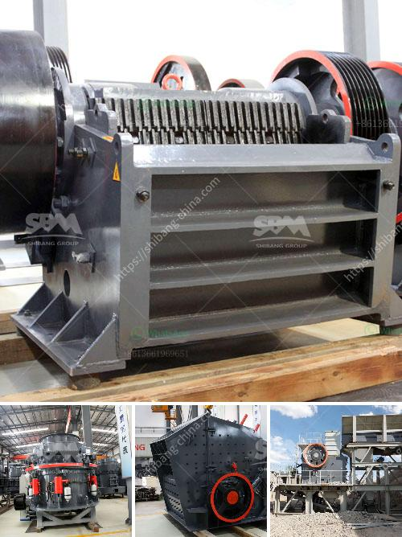

<h3>operation of stone crushing plant</h3>
Stone crushing plant is one-stop crushing installation, which can be used for rock crushing, garbage crushing, building materials crushing and other similar operations. Crushing plants may be either fixed or mobile, depending on the requirements. Stone crushing involves the following processes: mining, processing, crushing, screening and transportation.

Mining involves the extraction of valuable minerals or other geological materials from the earth. Depending on the type of stone extracted, the process may vary. In general, the main steps involve drilling and blasting, followed by crushing and screening processes to produce the required sizes.

The extracted stone is transported to a processing facility, where it is separated into various sizes using screens and crushers. This process ensures that the material meets the necessary product specifications before it is sent for further processing.

Once the stone reaches the desired size, it is fed into a crusher to break down the stone into smaller pieces. Crushers are commonly used for secondary and tertiary crushing stages. They are highly efficient and can process large quantities of stone in a short period.

After the stone is crushed, it is screened to separate the different sized particles. This ensures that the final product meets the required specifications for various applications. Screening can be done using different types of screens, such as vibrating screens, inclined screens, or grizzly screens.

Once the stone has been processed and screened, it needs to be transported to its final destination. This may involve loading the stone onto trucks or conveyors for transportation to construction sites or other locations. The transportation process should ensure that the stone is handled carefully to prevent any damage or loss.

Overall, the operation of a stone crushing plant is simple and straightforward. Just like any other industrial machinery, it is important to follow proper safety precautions and maintain the equipment to ensure its efficiency and longevity. Regular maintenance and inspections also minimize downtime and improve productivity.

Stone crushing plants play an important role in the construction industry as they provide the essential aggregates required for various construction activities. However, it is important to operate the plants following certain standardized procedures to ensure efficient operation and prevent any potential harm to the environment.

In conclusion, the operation of a stone crushing plant is a straightforward process. The primary objectives of these plants include uniform fragmentation of rock, controlled size distribution of the crushed material, and elimination of oversize materials. Proper operation and maintenance of the equipment are crucial to ensure the plant operates efficiently and safely.
<h3>Contact us</h3><ul><li><strong>Whatsapp:&nbsp;<a href="https://wa.me/8613661969651">+8613661969651</a></strong></li><li><a href="https://swt.shibang-china.com/?git&amp;zhl&amp;operation of stone crushing plant"><strong>Online Service(chat now)</strong></a></li></ul><h3>Related</h3><ul><li><a href='magnesium sulfate production line equipment.md'>magnesium sulfate production line equipment</a></li><li><a href='philippines crusher cebu crusher.md'>philippines crusher cebu crusher</a></li><li><a href='stone crusher for sale in zimbabwe.md'>stone crusher for sale in zimbabwe</a></li><li><a href='iron separator from steel slag.md'>iron separator from steel slag</a></li><li><a href='mode of oeration of a gyratory crusher.md'>mode of oeration of a gyratory crusher</a></li></ul>