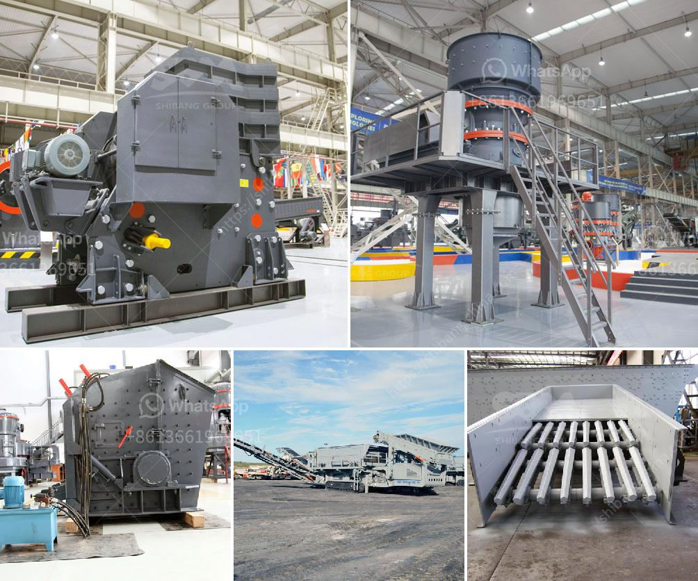

<h3>ore wash plant for sale</h3>
The importance of ore washing is becoming increasingly evident in today's mining industry. With stricter regulations on the use of water and environmental concerns surrounding the extraction of precious materials, the demand for efficient ore wash plants is on the rise.

Washed ore can be used in a variety of industrial applications such as concrete production and asphalt manufacturing. These materials must meet specific cleanliness and size requirements, making ore washing plants essential machinery for any mining operation.

When purchasing an ore wash plant for sale, it is crucial to consider several factors to ensure its effectiveness and long-term performance. Firstly, the plant should have a high capacity to handle a large volume of ore. This ensures that the mining operation can run smoothly without interruptions caused by the wash plant's limited capacity.

Secondly, the wash plant should have multiple stages of washing to remove impurities thoroughly. This includes scrubbing, rinsing, and screening processes. Each successive stage of washing ensures that the ore is cleaned to the desired standards before further processing.

Furthermore, the wash plant should be versatile enough to process various types of ore. Different ores have different characteristics, such as hardness and density, which require specific washing techniques. A flexible wash plant can adapt to these varying ore types, maximizing the plant's efficiency and productivity.

Lastly, the wash plant should be designed with sustainability in mind. Water recycling systems and sedimentation tanks can minimize water usage and prevent the release of contaminated water into the environment. Additionally, the use of energy-efficient components can reduce the plant's carbon footprint, contributing to a cleaner mining operation.

In conclusion, an ore wash plant for sale is a valuable investment for any mining company aiming to improve the quality of their final product while adhering to environmental regulations. By choosing a high-capacity, multi-stage, versatile, and sustainable wash plant, mining operations can clean their ore efficiently and responsibly, ensuring a greener and more sustainable future for the industry.
<h3>Contact us</h3><ul><li><strong>Whatsapp:&nbsp;<a href="https://wa.me/8613661969651">+8613661969651</a></strong></li><li><a href="https://swt.shibang-china.com/?git&amp;zhl&amp;ore wash plant for sale"><strong>Online Service(chat now)</strong></a></li></ul><h3>Related</h3><ul><li><a href='used asphalt plants for sale in japan.md'>used asphalt plants for sale in japan</a></li><li><a href='simple formula for belt conveyor.md'>simple formula for belt conveyor</a></li><li><a href='crusher used for copper ore.md'>crusher used for copper ore</a></li><li><a href='vertical ball mill with price.md'>vertical ball mill with price</a></li><li><a href='coal powder making process.md'>coal powder making process</a></li></ul>