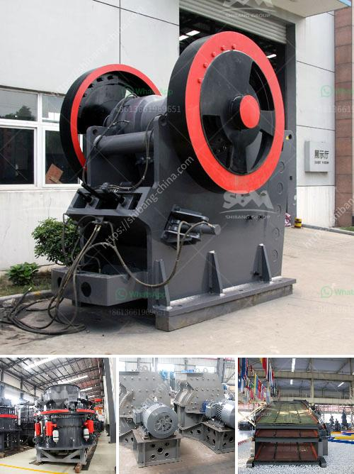

<h3>organic fertilizer production line in india</h3>
India is primarily an agricultural country, with a large section of its population engaged in farming. The agricultural sector of the country plays a crucial role in its economic growth, providing employment to millions of people and contributing significantly to its GDP. However, over the years, the excessive use of chemical fertilizers and pesticides has caused severe damage to the soil's fertility and hindered sustainable farming practices. In response to this challenge, the organic fertilizer production line has emerged as a game-changer in revolutionizing agriculture in India.

Organic fertilizer, also known as bio-fertilizer, is derived from natural sources such as animal waste, plant residue, and other organic materials. Unlike chemical fertilizers, organic fertilizers contain no harmful synthetic substances that can harm the soil, crops, or the environment. They are rich in essential nutrients, beneficial microorganisms, and organic matter, which improve soil fertility, enhance crop yield, and promote biodiversity in agricultural ecosystems.

With increasing awareness about the harmful effects of chemical fertilizers, the demand for organic fertilizers has been on the rise in India. The organic fertilizer production line offers an effective solution to meet this growing demand by converting organic waste into high-quality bio-fertilizers. The production line involves a series of processes that transform organic waste into nutrient-rich organic fertilizers.

The first step in the organic fertilizer production line is the collection and sorting of organic waste materials. This can include animal manure, crop residues, food waste, and other organic by-products. Once the waste is collected, it is then subjected to a process known as composting. Composting is a natural biological process in which microorganisms, such as bacteria and fungi, decompose the organic waste into a stable and nutrient-rich compost.

After the composting process, the next step is the fermentation of the compost. During fermentation, beneficial microorganisms further break down the organic matter, ensuring that it is biologically active and ready for use as fertilizer. This ensures that the nutrients present in the organic waste are easily accessible to plants, promoting healthy growth and development.

The fermented compost is then processed through a series of machines, such as crushers, mixers, granulators, and dryers, to produce the final organic fertilizer product. These machines help in achieving the desired texture, consistency, and nutrient content of the fertilizer. The final product is then packaged and ready for distribution to farmers.

The organic fertilizer production line has several benefits for Indian farmers. Firstly, it reduces their dependency on expensive chemical fertilizers, which can be a financial burden, especially for small-scale farmers. Secondly, the use of organic fertilizers improves the soil structure and enhances its water-holding capacity, leading to better nutrient absorption by crops. Additionally, organic fertilizers promote the growth of beneficial microorganisms in the soil, which helps combat plant diseases and pests naturally.

India has recognized the importance of organic farming practices, and the organic fertilizer production line has become an integral part of its agricultural landscape. The government has also taken several initiatives to promote organic farming and provide subsidies for the establishment of organic fertilizer production units across the country.

In conclusion, the organic fertilizer production line is revolutionizing agriculture in India by providing a sustainable and environmentally friendly alternative to chemical fertilizers. As more farmers recognize the benefits of organic fertilizers, their popularity continues to grow, resulting in healthier soil, increased crop yield, and a more sustainable agricultural sector.
<h3>Contact us</h3><ul><li><strong>Whatsapp:&nbsp;<a href="https://wa.me/8613661969651">+8613661969651</a></strong></li><li><a href="https://swt.shibang-china.com/?git&amp;zhl&amp;organic fertilizer production line in india"><strong>Online Service(chat now)</strong></a></li></ul><h3>Related</h3><ul><li><a href='aggregates crusher plant near in manila.md'>aggregates crusher plant near in manila</a></li><li><a href='price of grinding machine in bangladesh.md'>price of grinding machine in bangladesh</a></li><li><a href='mining and quarrying crusher machinery and equipment.md'>mining and quarrying crusher machinery and equipment</a></li><li><a href='aggregate crushing plant for sale.md'>aggregate crushing plant for sale</a></li><li><a href='thailand for stone crusher plant.md'>thailand for stone crusher plant</a></li></ul>