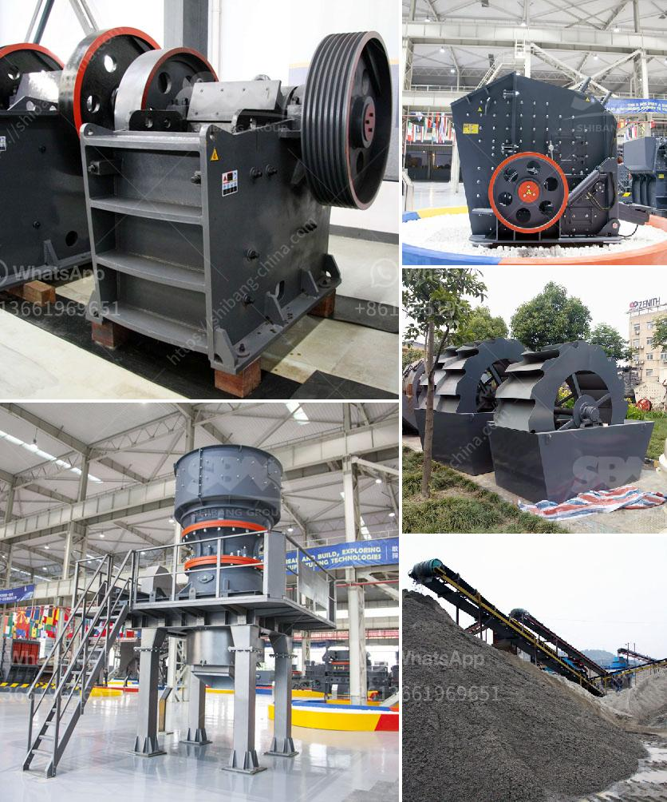

<h3>petroleum coke mill</h3>
Petroleum coke, also known as petcoke, is a byproduct of the oil refining process. It is a type of carbon material that is typically used as fuel in various industries. One of the key elements in producing high-quality petcoke is the petroleum coke mill.

A petroleum coke mill is a grinding equipment used to turn petroleum coke into fine powder. It can be used as a raw material in the production of cement, asphalt, and other industrial products. The process of petcoke grinding involves a series of steps designed to generate a powdered form of the carbon-rich material.

Firstly, the petcoke is crushed into smaller particles. This is usually done using crushers or hammer mills, which reduce the size of the raw material. The crushed petcoke is then transported to the grinding mill, where it is further refined.

The grinding mill is equipped with rotating blades that crush and grind the petcoke into a fine powder. This process is carried out in a closed system to prevent the release of any harmful particles into the atmosphere. The finely ground petcoke is then collected and stored for further use.

The petcoke mill can be either a vertical roller mill or a ball mill. Both types of mills have their advantages and disadvantages, depending on the specific needs of the application. The choice of mill also depends on factors such as the hardness of the petcoke and the desired particle size of the final product.

One advantage of using a petcoke mill is its efficiency in grinding the material. The mill is designed to maximize the grinding process, ensuring that all particles are properly broken down. This results in a high-quality powder with a consistent particle size distribution.

Another benefit of using a petcoke mill is its cost-effectiveness. Petcoke is typically cheaper than other carbon materials, making it an attractive option for industries looking to reduce production costs. The grinding process also helps to increase the energy efficiency of the material, further reducing overall expenses.

In addition to its use as a fuel source, petroleum coke has other applications. It can be used as a carbon additive in the steel industry, where it enhances the strength and durability of the final product. Petcoke is also used in the production of electrodes for the aluminum industry and as a raw material for the manufacturing of graphite.

However, it is worth noting that petroleum coke can have environmental implications. The combustion of petcoke releases carbon dioxide and other greenhouse gases into the atmosphere, contributing to climate change. Therefore, it is important to implement proper emissions controls and waste management strategies when using petcoke as a fuel source.

In conclusion, a petroleum coke mill is an essential piece of equipment in the petcoke grinding process. It plays a crucial role in producing high-quality petcoke powder that can be used in various industries. The mill's efficiency and cost-effectiveness make it a valuable asset for businesses looking to optimize their production processes and reduce expenses. However, it is important to consider the environmental impact of using petcoke and implement appropriate measures to mitigate any negative effects.
<h3>Contact us</h3><ul><li><strong>Whatsapp:&nbsp;<a href="https://wa.me/8613661969651">+8613661969651</a></strong></li><li><a href="https://swt.shibang-china.com/?git&amp;zhl&amp;petroleum coke mill"><strong>Online Service(chat now)</strong></a></li></ul><h3>Related</h3><ul><li><a href='100tph stone crusher price list.md'>100tph stone crusher price list</a></li><li><a href='silica sand crusher in ghana.md'>silica sand crusher in ghana</a></li><li><a href='rock crusher gravel production.md'>rock crusher gravel production</a></li><li><a href='buy nigeria stone crusher.md'>buy nigeria stone crusher</a></li><li><a href='stone crusher plant machinery.md'>stone crusher plant machinery</a></li></ul>