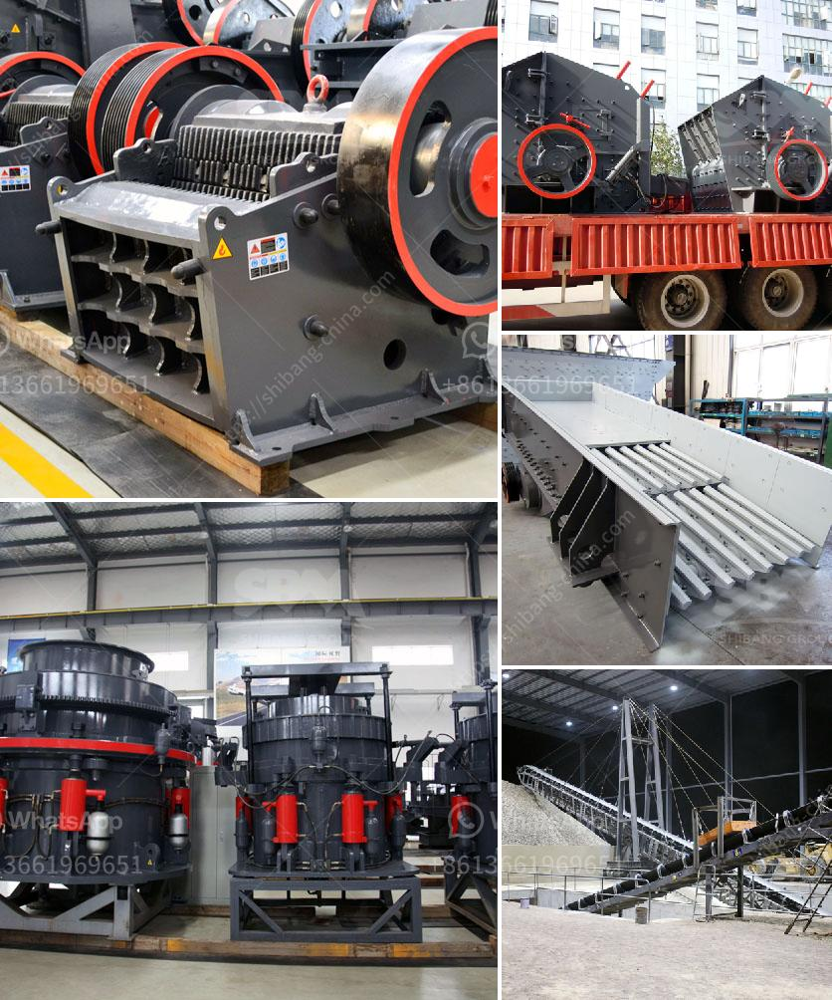

<h3>philippines crusher cebu crusher</h3>
The Philippines is a country blessed with an abundance of natural resources, making it a thriving hub for industries such as mining and construction. As these industries continue to grow, the demand for efficient machinery also increases. One particular machine that has proven to be essential in the construction industry is the crusher.

In Cebu, one of the largest cities in the Philippines, crushers play a crucial role in processing materials such as stones and aggregates used for construction. A crusher is a machine that breaks down large rocks into smaller ones. It is commonly used in construction sites and quarries to crush various materials into specific sizes for different purposes.

What sets Cebu crushers apart from others is their ability to handle a wide range of materials and produce high-quality outputs. These crushers are designed to withstand heavy-duty operations, ensuring durability and longevity. They can efficiently process not only rocks but also concrete, asphalt, and other materials commonly used in construction projects.

Furthermore, Cebu crushers are known for their flexibility, ease of operation, and low maintenance requirements. With advanced features and technologies, these machines offer precise and efficient crushing capabilities. They are equipped with powerful motors and adjustable settings, allowing operators to customize the output size according to their specific needs.

Another advantage of Cebu crushers is their affordability. While quality should never be compromised, the crushers available in Cebu are reasonably priced, making them accessible to both large construction companies and small-scale contractors. This accessibility ensures that quality materials can be produced without compromising budget constraints.

Moreover, the availability of crushers in Cebu contributes to the local economy by generating jobs and promoting sustainable development. With the increasing demand for construction materials, the crusher industry plays a significant role in providing employment opportunities to the local population.

In conclusion, crushers are essential machines in the construction industry of the Philippines, particularly in Cebu. They offer efficient and reliable crushing capabilities, allowing for the production of high-quality materials needed for various construction projects. The affordability and accessibility of these crushers contribute to the growth of the local economy and provide employment opportunities. Thus, the presence of crushers in Cebu is vital for the continued development of the construction industry in the Philippines.
<h3>Contact us</h3><ul><li><strong>Whatsapp:&nbsp;<a href="https://wa.me/8613661969651">+8613661969651</a></strong></li><li><a href="https://swt.shibang-china.com/?git&amp;zhl&amp;philippines crusher cebu crusher"><strong>Online Service(chat now)</strong></a></li></ul><h3>Related</h3><ul><li><a href='jaw crushers liners.md'>jaw crushers liners</a></li><li><a href='stone crusher machine japan.md'>stone crusher machine japan</a></li><li><a href='rock quarry equipment.md'>rock quarry equipment</a></li><li><a href='gold ore crusher machine.md'>gold ore crusher machine</a></li><li><a href='conveyor systems for sand and gravel.md'>conveyor systems for sand and gravel</a></li></ul>