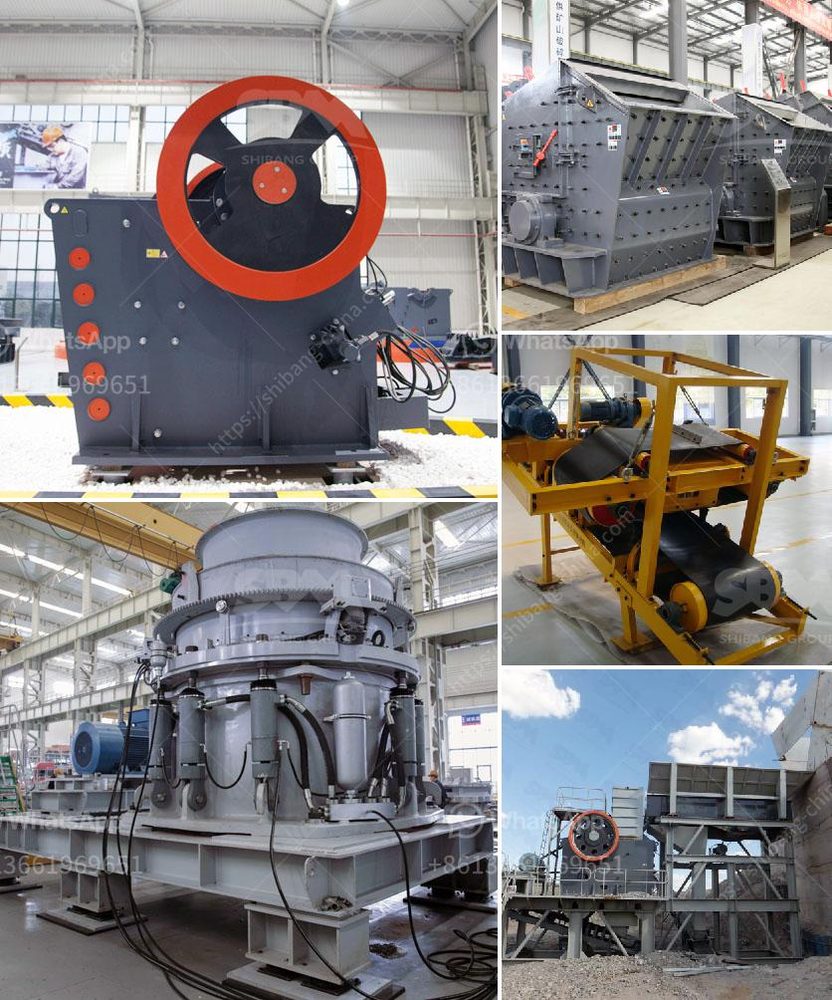

<h3>philippines crusher manufacturers in pakistan</h3>
The Philippines is a leading manufacturer and exporter of stone and mineral resources around the world. The country has vast mineral deposits and potential resources that can help Pakistan meet its growing demand for construction materials. With the Philippines' expertise in manufacturing crushers and other construction equipment, it has become a trusted partner for Pakistan's construction industry.

Crushers are essential equipment in any construction project as they efficiently break down large rocks into smaller, more manageable sizes. This process allows for easier transportation and utilization of these materials for various construction purposes. In Pakistan, where infrastructure development is at its peak, the demand for crushers is high.

Philippines crusher manufacturers understand the importance of efficiency and durability when it comes to producing construction equipment that can handle the demanding tasks required in the country's infrastructure projects. There is a growing trend of hiring Filipino workers for their expertise in operating and maintaining crushers, ensuring maximum productivity and longevity of the equipment.

These Filipino crusher manufacturers are known for their dedication to customer satisfaction, providing comprehensive after-sales support. They work closely with their clients, understanding their specific requirements and offering customized solutions. Whether it's a primary jaw crusher or a secondary cone crusher, the Philippines' manufacturers are equipped to handle any size reduction project.

Moreover, the Filipino crusher manufacturers are quick to adapt to the evolving needs of the construction industry. They continuously innovate and incorporate advanced technologies to improve the efficiency, safety, and environmental sustainability of their products. From energy-efficient motors to dust suppression systems, they make sure that their crushers not only meet but exceed industry standards.

In conclusion, the Philippines' crusher manufacturers are a reliable partner for Pakistan's construction industry. Their extensive range of crushers, combined with their dedication to excellent customer service, ensures that they can provide efficient crushing solutions that meet the specific needs of any construction project. With their expertise and innovation, Filipino crusher manufacturers are poised to continue supporting Pakistan's infrastructure development for years to come.
<h3>Contact us</h3><ul><li><strong>Whatsapp:&nbsp;<a href="https://wa.me/8613661969651">+8613661969651</a></strong></li><li><a href="https://swt.shibang-china.com/?git&amp;zhl&amp;philippines crusher manufacturers in pakistan"><strong>Online Service(chat now)</strong></a></li></ul><h3>Related</h3><ul><li><a href='mode of oeration of a gyratory crusher.md'>mode of oeration of a gyratory crusher</a></li><li><a href='quarry crushing equipments manufacturers.md'>quarry crushing equipments manufacturers</a></li><li><a href='gravel gravel and sand mining equipment.md'>gravel gravel and sand mining equipment</a></li><li><a href='activated bentonite production line.md'>activated bentonite production line</a></li><li><a href='roll mills supplier in karachi.md'>roll mills supplier in karachi</a></li></ul>