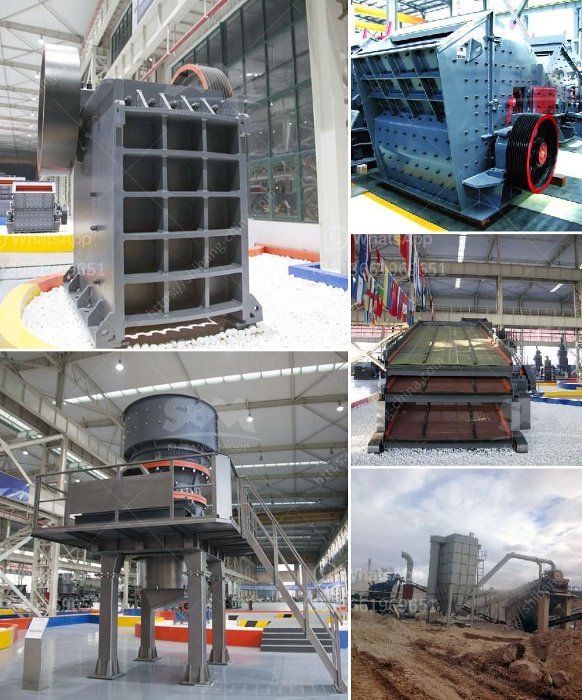

<h3>picture of cone crusher</h3>
A cone crusher is a mining equipment that reduces the size of feed material by squeezing or compressing it between an eccentrically gyrating spindle, which is covered by a wear-resistant mantle, and an enclosing concave hopper, which is covered by a manganese concave or a bowl liner. As the material enters the top of the cone crusher, it becomes wedged and squeezed between the mantle and the bowl liner, a process known as "crushing". This crushing action is caused by the gyrating movement of the main shaft, which is powered by an electric motor or diesel engine.

In the world of mining and aggregate processing, cone crushers are one of the most widely used types of crusher. They are typically used in secondary and tertiary crushing stages to reduce the size of medium to hard and abrasive feed materials. Cone crushers are often used in the production of road base, aggregates, asphalt mixes, and concrete aggregates.

A picture of a cone crusher can help you understand the cone crusher better. Here are details about the cone crusher illustrated in the picture:

Firstly, cone crusher is a large-sized machine with a high crushing chamber, so you can see the feeding size is large. The finer the output size, the more materials it can crush. In addition, the cone crusher has a fast crushing speed, high crushing efficiency, and a large capacity.

Secondly, the picture shows the discharge opening of the cone crusher is adjustable. The adjustment mechanism allows you to adjust the clearance between the mantle and concave, which determines the final product size. This feature is beneficial as it can produce a variety of product sizes depending on the application requirements.

Thirdly, the picture illustrates the cone crusher's durable and wear-resistant construction. The mantle and concave are typically made of manganese steel, which is known for its high resistance to wear and tear. This ensures that the cone crusher can withstand the high pressures and abrasive forces generated during the crushing process, leading to a longer lifespan of the machine.

Finally, the picture depicts the cone crusher's efficient and reliable hydraulic system. The hydraulic system enables the cone crusher to quickly and easily adjust the crusher settings, which typically include the CSS (closed-side setting) and the eccentric throw. This feature allows for precise control over the final product size and shape.

In conclusion, a picture of a cone crusher provides a visual representation of this powerful and versatile piece of equipment. With its efficient crushing action, adjustable discharge opening, and robust construction, the cone crusher is a reliable and efficient crushing solution for a wide range of applications in the mining and aggregate industry.
<h3>Contact us</h3><ul><li><strong>Whatsapp:&nbsp;<a href="https://wa.me/8613661969651">+8613661969651</a></strong></li><li><a href="https://swt.shibang-china.com/?git&amp;zhl&amp;picture of cone crusher"><strong>Online Service(chat now)</strong></a></li></ul><h3>Related</h3><ul><li><a href='robo sand manufacturing process.md'>robo sand manufacturing process</a></li><li><a href='rock crusher dust fog control system philippines.md'>rock crusher dust fog control system philippines</a></li><li><a href='used gold ore processing equipment for sale.md'>used gold ore processing equipment for sale</a></li><li><a href='lavadoras de arenas y agregados.md'>lavadoras de arenas y agregados</a></li><li><a href='vibrating screen estimating.md'>vibrating screen estimating</a></li></ul>