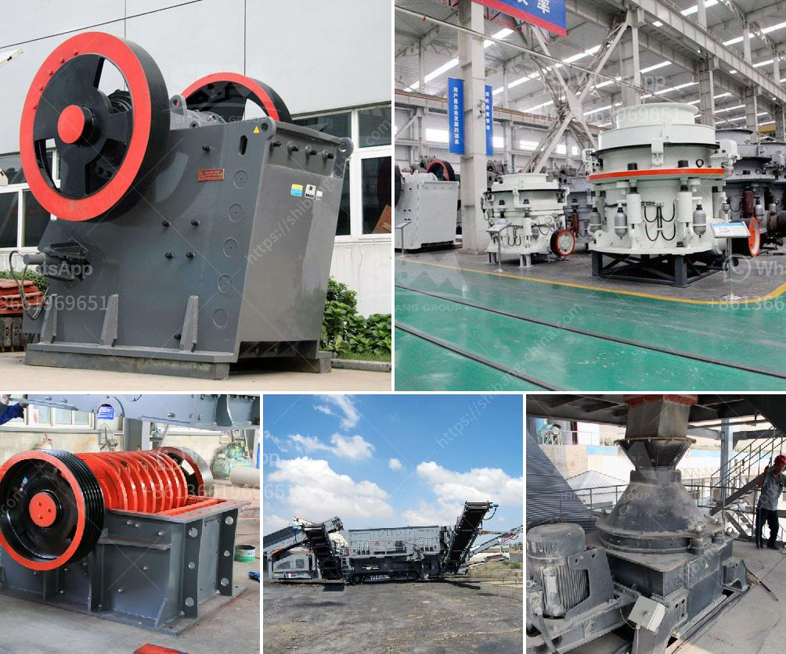

<h3>pictures of copper ore mining nigeria</h3>
Nigeria, an African nation blessed with immense natural resources, has showcased its potential through various sectors such as oil, agriculture, and more recently, mining. One particular mining industry that has gained significant attention in recent years is copper ore mining. The exploration and extraction of copper ores have proven to be a valuable enterprise for Nigeria, employing thousands of individuals and contributing significantly to the country's economic growth. In this article, we delve into the fascinating world of copper ore mining in Nigeria, showcasing vivid pictures that portray this industry's vitality and potential.

The Nigerian mining sector has experienced a remarkable rise in exploration activities and investment in recent years. With over 44 different mineral types in the country, copper ore mining has emerged as a prominent sector. Copper is a vital element used in various applications, from electrical wiring to construction, making it an essential metal for Nigeria's industrial advancement.

Exploration activities in copper-rich areas across Nigeria have led to the discovery of numerous mining sites. The pictures capture the vast landscapes where mining activities take place, showcasing the country's diverse topography and natural resources. From the arid northern regions to the lush forests in the southern parts of Nigeria, these images stand as a testament to the geological diversity that characterizes the nation.

One particular region that has attracted significant attention in copper mining is Zamfara State, located in Nigeria's northern part. The pictures unveil the impressive scale of mining operations in this region, with workers actively engaged in extracting the precious copper ores. These images reflect the dedication and hard work of individuals who contribute tirelessly to this industry, signifying their commitment to Nigeria's economic development.

Furthermore, the pictures illustrate the advanced mining techniques employed in Nigeria's copper mining industry. Modern equipment and machinery are utilized to improve efficiency and safety in these mining operations. From excavators and drilling machines to conveyor belts and ore processing plants, these images showcase Nigeria's commitment to adopting state-of-the-art technology in its mining processes.

Notably, these photographs also capture the impact of copper ore mining on the environment. While the mining industry generates economic benefits, it also needs to be mindful of its environmental footprint. The images demonstrate efforts made by mining companies to minimize their ecological impact. From responsible waste management practices to land rehabilitation initiatives, these pictures highlight Nigeria's commitment to sustainable mining practices, ensuring the long-term integrity of its natural resources.

In conclusion, the pictures of copper ore mining in Nigeria provide a compelling glimpse into the vast potential and significance of this industry. From the exploration and extraction processes to the economic impact and environmental considerations, these images encapsulate the multifaceted nature of Nigeria's copper mining sector. As the country continues to develop its mining industry, it is essential to strike a balance between economic growth and sustainable practices, ensuring the responsible utilization of these valuable mineral resources. With continued investment and exploration, Nigeria's copper mining industry is well-poised to contribute further to the country's socio-economic development in the years to come.
<h3>Contact us</h3><ul><li><strong>Whatsapp:&nbsp;<a href="https://wa.me/8613661969651">+8613661969651</a></strong></li><li><a href="https://swt.shibang-china.com/?git&amp;zhl&amp;pictures of copper ore mining nigeria"><strong>Online Service(chat now)</strong></a></li></ul><h3>Related</h3><ul><li><a href='rock crusher production line.md'>rock crusher production line</a></li><li><a href='cement company in protea glen.md'>cement company in protea glen</a></li><li><a href='komatsu crawler jaw crusher.md'>komatsu crawler jaw crusher</a></li><li><a href='stone crusher discount.md'>stone crusher discount</a></li><li><a href='coal washing plant for sale.md'>coal washing plant for sale</a></li></ul>