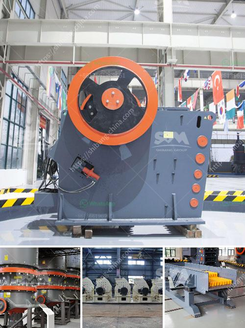

<h3>pineaple crushing machine in ghana</h3>
Ghana is known for its abundance of natural resources, including gold, cocoa, and oil. However, agriculture remains one of the predominant sectors in the country, employing a significant portion of the population. Within this sector, pineapple production has emerged as a crucial sub-sector, contributing to both export earnings and promoting food security. As the demand for pineapple continues to rise, innovation in processing techniques, such as the introduction of pineapple crushing machines, has become a game-changer for pineapple farmers in Ghana.

Traditionally, pineapple processing involved labor-intensive methods, such as peeling and cutting by hand. These methods resulted in high production costs, low efficiency, and limited capacity for large-scale production. The introduction of pineapple crushing machines has revolutionized the industry by significantly reducing production time and costs while increasing efficiency and productivity.

Pineapple crushing machines are mechanical devices that effectively extract juice and pulp from pineapples. These machines have a rotating blade mechanism that crushes the pineapple into small pieces, extracting the juice and separating the pulp from the waste. The resultant juice and pulp can be used for various purposes, including pineapple concentrate, jams, jellies, and other pineapple-based products. The waste can be repurposed as animal feed or organic fertilizer, reducing environmental pollution.

One of the primary advantages of pineapple crushing machines is the increased processing capacity they offer. With traditional methods, farmers were limited in the quantity of pineapple they could process due to the time-consuming nature of manual work. However, these machines can process a significant amount of pineapple in a short time, enabling farmers to meet large orders and expand their businesses. This increased processing capacity has led to higher incomes for pineapple farmers, as they are now able to access larger markets both domestically and internationally.

Furthermore, pineapple crushing machines have enhanced the quality and consistency of processed pineapple products. With manual methods, variations in the size and shape of fruit pieces could occur, resulting in inconsistencies in juice concentration and quality. However, the machines' precise and uniform crushing mechanism ensures consistent results, guaranteeing high-quality pineapple juice and pulp. This improvement in product quality has enabled Ghanaian pineapple products to meet international standards, leading to increased export opportunities.

The introduction of pineapple crushing machines has not only benefited individual farmers but has also contributed to the overall development of the agricultural sector in Ghana. Increased pineapple processing capacity has stimulated job creation, as more workers are needed to operate and maintain these machines. Additionally, the production of pineapple-based products has sparked the growth of downstream industries, such as juice processing companies and packaging firms, further boosting the economy.

In conclusion, the introduction of pineapple crushing machines has been a game-changer for pineapple farmers in Ghana. These machines have increased processing capacity, improved product quality, and stimulated economic growth. As the demand for pineapple continues to grow, it is essential for the government and stakeholders to support farmers in accessing these machines, either through subsidies or favorable financing options. By doing so, Ghana can solidify its position as a leading exporter of pineapple products while empowering its agricultural sector.
<h3>Contact us</h3><ul><li><strong>Whatsapp:&nbsp;<a href="https://wa.me/8613661969651">+8613661969651</a></strong></li><li><a href="https://swt.shibang-china.com/?git&amp;zhl&amp;pineaple crushing machine in ghana"><strong>Online Service(chat now)</strong></a></li></ul><h3>Related</h3><ul><li><a href='trommel ball mill.md'>trommel ball mill</a></li><li><a href='equipo del molino de bolas 750 hp precio del motor.md'>equipo del molino de bolas 750 hp precio del motor</a></li><li><a href='complete crushing for sale with price.md'>complete crushing for sale with price</a></li><li><a href='crushing and screening of aggregates in mexico.md'>crushing and screening of aggregates in mexico</a></li><li><a href='aggregate crushing plant and processing.md'>aggregate crushing plant and processing</a></li></ul>