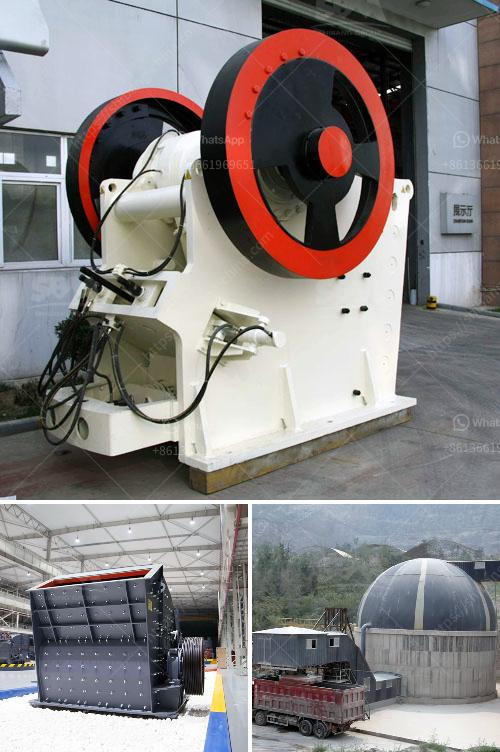

<h3>portable ballast crusher</h3>
Ballast, commonly known as gravel or coarse stone, is a crucial component of the railway track formation. A layer of either bed of concrete or asphalt is laid on the roadbed to provide support to the railway tracks. The ballast, along with the sub-base, forms the major support to the rails and facilitates the drainage of water away from the tracks.

Traditionally, ballast crushers have been created to deal with bulky stones and hog them down to smaller gravels. Whether you were working on a mining site, quarry, or construction site, a portable stone crusher would bring you satisfactory results. In this article, we will discuss the pros and cons of portable ballast crusher.

The portable crusher, used by the contractors in recycling, demolition, and remote job sites, is an effective option to reduce construction costs. The globally recognized solution converts the debris into usable raw materials, ultimately saving on transportation costs, landfill space, and natural resources.

The portable ballast crusher can be easily transported from one location to another. With a minimal setup time, it allows for increased productivity and flexibility on-site. Whether you are working on a railroad construction site or mining material in a remote area, a portable ballast crusher can streamline your project.

As sustainability becomes increasingly important, a portable ballast crusher can contribute to environmental conservation. By crushing the demolished concrete or stone into smaller pieces, it can be used as aggregate for new construction projects. This reduces the need for new raw materials, minimizes waste generation, and lowers the carbon footprint.

Investing in a portable ballast crusher is a wise choice as it eliminates the need for large-scale crushing machinery and reduces operational costs. The availability of affordable portable crushers provides an opportunity for small-scale contractors or construction companies to be competitive in the market.

Portable ballast crushers are usually set to produce specific sizes of aggregate material. If you require different sizes for various applications, you may need to invest in multiple crushers or screening equipment, which could increase your overall costs.

Portable crushers require a reliable power source, such as electricity or a generator, to operate. Depending on the project location, the availability of power sources may limit the efficiency and effectiveness of the crusher.

Like any mechanical equipment, portable ballast crushers require regular maintenance and repairs. Lack of proper maintenance can lead to breakdowns and unexpected downtime, impacting productivity and project timelines.

In conclusion, a portable ballast crusher provides an innovative solution for effective track maintenance. Its mobility, environmental benefits, and cost-effectiveness make it a practical choice for various construction projects. However, drawbacks such as output size limitations, power source dependency, and maintenance requirements should be considered before making a purchase. By carefully evaluating your project requirements, you can determine whether a portable ballast crusher is a suitable investment for your business.
<h3>Contact us</h3><ul><li><strong>Whatsapp:&nbsp;<a href="https://wa.me/8613661969651">+8613661969651</a></strong></li><li><a href="https://swt.shibang-china.com/?git&amp;zhl&amp;portable ballast crusher"><strong>Online Service(chat now)</strong></a></li></ul><h3>Related</h3><ul><li><a href='cone crushers south africa.md'>cone crushers south africa</a></li><li><a href='picture of cone crusher.md'>picture of cone crusher</a></li><li><a href='simple grinding mill type in ethiopia.md'>simple grinding mill type in ethiopia</a></li><li><a href='rock crusher plant for sale.md'>rock crusher plant for sale</a></li><li><a href='mobile crusher machine supplier.md'>mobile crusher machine supplier</a></li></ul>