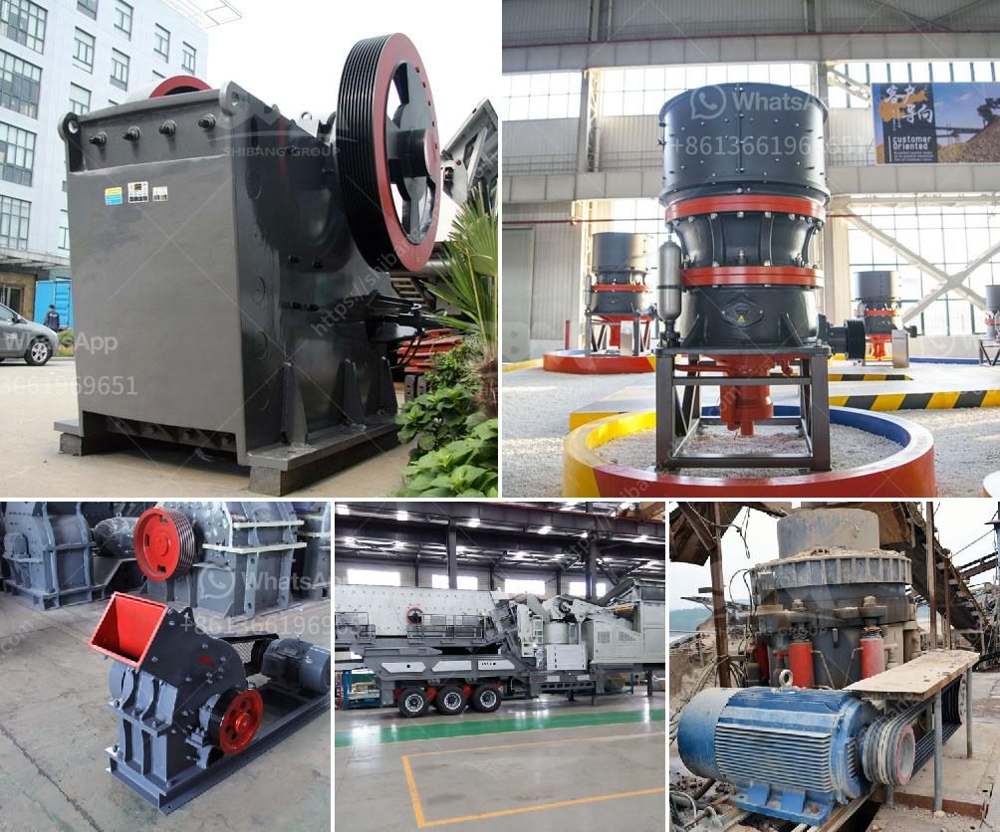

<h3>portable cement plant for sale in usa</h3>
When it comes to construction projects, time is of the essence. Contractors and builders are constantly seeking innovative and efficient solutions that can help them meet deadlines without compromising on quality. In recent years, portable cement plants have emerged as a game-changer in the construction industry, providing a flexible and cost-effective alternative to traditional stationary plants.

A portable cement plant, also known as a mobile batch plant, is a compact and self-contained unit that can be easily transported to construction sites, allowing for on-site production of concrete. This eliminates the need for long-distance transportation of ready-mix concrete, saving both time and money. Additionally, portable cement plants are customizable and can be set up to meet specific project requirements, providing enhanced flexibility for contractors.

In the USA, there are numerous options available for those looking to invest in a portable cement plant. These plants are typically equipped with state-of-the-art technology and machinery, ensuring high-quality concrete production. They are capable of producing a wide range of concrete mixes, including specialty mixes for specialized construction applications.

One of the major advantages of portable cement plants is their ability to maximize productivity. With on-site concrete production, contractors can optimize resources and reduce waiting times for concrete deliveries, greatly enhancing project efficiency. The plants are designed for easy installation and can be quickly set up and operational within a short period, allowing construction work to commence without delay.

Furthermore, portable cement plants offer environmental benefits. By producing concrete on-site, carbon emissions associated with long-distance transportation of ready-mix concrete are significantly reduced. This aligns with the growing demand for sustainable construction practices and enables contractors to contribute to eco-friendly projects.

In conclusion, the availability of portable cement plants for sale in the USA has revolutionized the construction industry by offering an efficient and flexible solution. These plants not only save time and money but also provide the ability to produce high-quality concrete on-site. With the numerous options available, contractors can choose the perfect portable cement plant that meets their specific project needs, ensuring successful and timely completion.
<h3>Contact us</h3><ul><li><strong>Whatsapp:&nbsp;<a href="https://wa.me/8613661969651">+8613661969651</a></strong></li><li><a href="https://swt.shibang-china.com/?git&amp;zhl&amp;portable cement plant for sale in usa"><strong>Online Service(chat now)</strong></a></li></ul><h3>Related</h3><ul><li><a href='almada crusher machine in mumbai.md'>almada crusher machine in mumbai</a></li><li><a href='harga screw conveyor batching plant.md'>harga screw conveyor batching plant</a></li><li><a href='grinding mill to produce particle size.md'>grinding mill to produce particle size</a></li><li><a href='quarrying crusher machines south africa.md'>quarrying crusher machines south africa</a></li><li><a href='what is the feed of jaw crusher.md'>what is the feed of jaw crusher</a></li></ul>